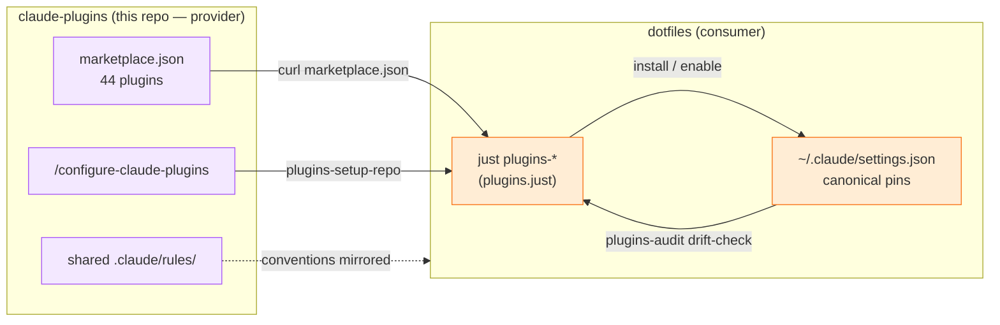

# Claude Plugins

> Experimental testing harness lives under experiments/claude-probe/.

A curated collection of 44 Claude Code plugins providing 400+ skills and 21 agents for development workflows.

## Install the Marketplace

Install the full plugin collection as a marketplace:

```bash
claude plugin install laurigates/claude-plugins
```

This registers all 44 plugins. You can then enable individual plugins as needed.

### Install Individual Plugins

If you prefer to install plugins one at a time:

```bash
claude plugin install laurigates-claude-plugins/<plugin-name>
```

For example:

```bash
claude plugin install laurigates-claude-plugins/git-plugin
claude plugin install laurigates-claude-plugins/python-plugin
claude plugin install laurigates-claude-plugins/testing-plugin
```

## Getting Started

1. **Install the marketplace** using the command above
2. **Run a health check** — `/health:check` then `/health:audit` to diagnose your setup and get plugin recommendations for your stack
3. **Follow the tiered setup** — The [Plugin Map](docs/PLUGIN-MAP.md) provides a recommended install order (Tier 0 foundation through Tier 3+ stack-specific), decision trees, and project presets

### MCP Server Setup

Use the included justfile for quick MCP server configuration:

```bash
# Set up all MCP servers and cclsp
just claude-setup

# Or install individual servers
just mcp-github
just mcp-playwright
just mcp-context7
```

Alternatively, use the `/configure:mcp` skill for interactive configuration.

## Design Principles

The methodology behind these plugins — what a probabilistic agent should decide
versus what a deterministic substrate should verify and remember. See
[**docs/PRINCIPLES.md**](docs/PRINCIPLES.md) for the full set, each grounded in
the rules, skills, and hooks that embody it.

## Prerequisites

- **Bash 5+** — Required for shell scripts. macOS ships Bash 3.2; install via `brew install bash`.

## Plugins by Category

### AI & Agents

| Plugin | Skills | Description |
|--------|--------|-------------|
| **agent-patterns-plugin** | 19 | Multi-agent coordination and orchestration patterns |
| **agents-plugin** | 1 + 12 agents | Task-focused agents for test, review, debug, docs, and CI workflows |
| **langchain-plugin** | 4 | LangChain JS/TS development - agents, chains, LangGraph, Deep Agents |
| **prompt-engineering-plugin** | 1 | Prompt engineering for accurate, grounded responses - anti-hallucination workflow |

### Development

| Plugin | Skills | Description |
|--------|--------|-------------|
| **api-plugin** | 1 | API integration and testing - REST endpoints, client generation |
| **blueprint-plugin** | 35 | Blueprint Development methodology - PRD/PRP workflow with version tracking |
| **comfyui-plugin** | 17 | ComfyUI custom-node pack lifecycle - scaffold, seed repo, gitops adoption, registry publish |
| **home-assistant-plugin** | 4 | Home Assistant configuration - automations, scripts, scenes, entities |
| **obsidian-plugin** | 21 | Obsidian CLI operations - vault management, search, properties, tasks |
| **project-plugin** | 7 | Project initialization, management, maintenance, and continuous development |
| **session-plugin** | 4 | Session bookends - spinup briefing, wrap capture, end-of-session orchestration, distillation |

### Languages

| Plugin | Skills | Description |
|--------|--------|-------------|
| **css-plugin** | 2 | CSS tooling - Lightning CSS transpilation, UnoCSS atomic utilities |
| **python-plugin** | 16 | Python ecosystem - uv, ruff, pytest, basedpyright, packaging |
| **rust-plugin** | 7 | Rust development - cargo, clippy, nextest, memory safety |
| **typescript-plugin** | 17 | TypeScript development - Bun, Biome, ESLint, strict types |

### Quality & Testing

| Plugin | Skills | Description |
|--------|--------|-------------|
| **code-quality-plugin** | 15 | Code review, refactoring, linting, static analysis, debugging methodology |
| **software-design-plugin** | 5 | Software design methodology - deep modules, design by contract, GoF pattern selection, legacy seams, pseudocode |
| **evaluate-plugin** | 6 + 3 agents | Skill evaluation and benchmarking - test effectiveness, grade results |
| **codebase-attributes-plugin** | 3 | Structured codebase health attributes with severity-based agent routing |
| **feedback-plugin** | 1 | Session feedback analysis - capture skill bugs and enhancements as issues |
| **testing-plugin** | 17 | Test execution, TDD workflow, Vitest, Playwright, mutation testing |

### Version Control

| Plugin | Skills | Description |
|--------|--------|-------------|
| **git-plugin** | 38 + 1 agent | Git workflows - commits, branches, PRs, worktrees, release-please |

### CI/CD

| Plugin | Skills | Description |
|--------|--------|-------------|
| **finops-plugin** | 7 | GitHub Actions FinOps - billing, cache usage, workflow efficiency |
| **github-actions-plugin** | 8 | GitHub Actions CI/CD - workflows, authentication, inspection |

### Infrastructure

| Plugin | Skills | Description |
|--------|--------|-------------|
| **configure-plugin** | 48 | Project infrastructure standards - pre-commit, CI/CD, Docker, testing |
| **container-plugin** | 9 + 1 agent | Container development - Docker, registry, Skaffold, OrbStack |
| **kubernetes-plugin** | 8 + 1 agent | Kubernetes and Helm - deployments, charts, releases, ArgoCD |
| **migration-patterns-plugin** | 6 | Safe database and system migration - dual write, shadow mode |
| **networking-plugin** | 7 | Network diagnostics, discovery, monitoring, HTTP load testing |
| **terraform-plugin** | 6 + 1 agent | Terraform and Terraform Cloud - infrastructure as code |

### Documentation & Communication

| Plugin | Skills | Description |
|--------|--------|-------------|
| **blog-plugin** | 2 | Blog post creation - project logs, technical write-ups |
| **communication-plugin** | 2 | Communication formatting - Google Chat, ticket drafting |
| **documentation-plugin** | 5 | Documentation generation - API docs, README, knowledge graphs |
| **prose-plugin** | 2 | Prose transformation - synthesis, distillation, tone, clarity |

### UX & Components

| Plugin | Skills | Description |
|--------|--------|-------------|
| **accessibility-plugin** | 2 | Accessibility implementation - WCAG, ARIA, design tokens |
| **component-patterns-plugin** | 2 | Reusable UI component patterns - version badge, tooltips |

### Automation & Utilities

| Plugin | Skills | Description |
|--------|--------|-------------|
| **health-plugin** | 7 | Diagnose and fix Claude Code configuration issues |
| **hooks-plugin** | 4 | Claude Code hooks for enforcing best practices |
| **macos-plugin** | 8 | macOS dev tooling - kitty session persistence, LaunchServices health, incident postmortems, APFS disk-usage / space recovery, performance triage and benchmark suite, dead-keybinding debug |
| **taskwarrior-plugin** | 9 | Taskwarrior coordination for multi-agent work - parallel-safe queries, urgency scoring |
| **tools-plugin** | 15 | General utilities - fd, rg, jq, shell, ImageMagick, d2 |
| **workflow-orchestration-plugin** | 4 | Workflow orchestration - preflight checks, checkpoint refactoring |

### Game Development

| Plugin | Skills | Description |
|--------|--------|-------------|
| **bevy-plugin** | 2 | Bevy game engine - ECS, rendering, game architecture |

## Plugin Structure

Each plugin follows the standard Claude Code plugin structure:

```
<plugin-name>/
├── .claude-plugin/
│   └── plugin.json     # Plugin manifest
├── README.md           # Plugin documentation
├── CHANGELOG.md        # Auto-generated by release-please
├── skills/
│   └── <skill-name>/
│       └── SKILL.md    # Skill definition
└── agents/             # Agent definitions (optional)
    └── <agent>.md
```

## Ecosystem: consumed by dotfiles

This marketplace's primary real-world consumer is
[`laurigates/dotfiles`](https://github.com/laurigates/dotfiles), which installs,
pins, and dogfoods the plugins via `just` recipes. The two repos form a
provider ↔ consumer symbiosis:



- **Provider → consumer:** `dotfiles`' `plugins-install` fetches this repo's
  `marketplace.json`; `plugins-setup-repo` runs `/configure-claude-plugins` to
  wire a target repo to the marketplace.
- **Consumer → provider:** `plugins-audit` / `plugins-sync-repo` compare each
  repo's committed `enabledPlugins` against the canonical pin set, exercising the
  marketplace as a live consumer.
- **Shared conventions:** `conventional-commits`, `parallel-safe-queries`,
  `gh-json-fields`, and `bash-tool-replacements` rules exist in both repos.

The authoritative diagram (with the full `just` module/group layout) lives in the
consumer repo: [`dotfiles/docs/justfile-architecture.md`](https://github.com/laurigates/dotfiles/blob/main/docs/justfile-architecture.md).
Justfile authoring/auditing for both repos is governed by this marketplace's
`tools-plugin:justfile-expert` and `configure-plugin:configure-justfile`.

## Development

Plugins use [release-please](https://github.com/googleapis/release-please) for automated versioning. Use conventional commits to trigger releases:

```bash
feat(git-plugin): add worktree support    # minor bump
fix(python-plugin): handle empty venv     # patch bump
```

See `CLAUDE.md` for detailed development instructions.

## Regenerating the Plugin List

The flat plugin list can be generated from `marketplace.json`:

```bash
jq -r '.plugins[] | "| **\(.name)** | \(.category) | \(.description) |"' .claude-plugin/marketplace.json
```

## License

MIT
