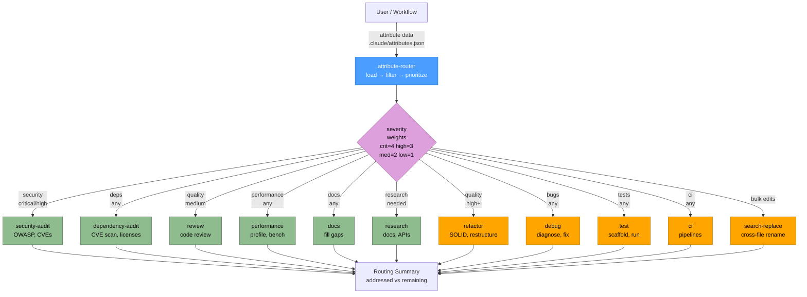

# Agents Plugin Flow

## Legend

| Node style | Meaning |
|------------|---------|
| Blue | Router agent (`attribute-router`) |
| Green | Read-only analysis agent (audit, review, profile, research, docs) |
| Orange | Write-capable agent (mutates code, tests, CI config) |
| Purple | Severity / category decision point |

## Category → Agent mapping

| Attribute category | Severity threshold | Agent | Role |
|--------------------|--------------------|-------|------|
| `security` | critical / high | `security-audit` | Analysis |
| `dependencies` | any | `dependency-audit` | Analysis |
| `quality` | high+ | `refactor` | Write |
| `quality` | medium | `review` | Analysis |
| `bugs` | any | `debug` | Write |
| `tests` | any | `test` | Write |
| `performance` | any | `performance` | Analysis |
| `docs` | any | `docs` | Analysis |
| `ci` | any | `ci` | Write |
| `research` | any | `research` | Analysis |
| `bulk-edit` | any | `search-replace` | Write |

Priority = sum of severity weights (critical=4, high=3, medium=2, low=1) across findings routed to each agent; higher totals run first.
