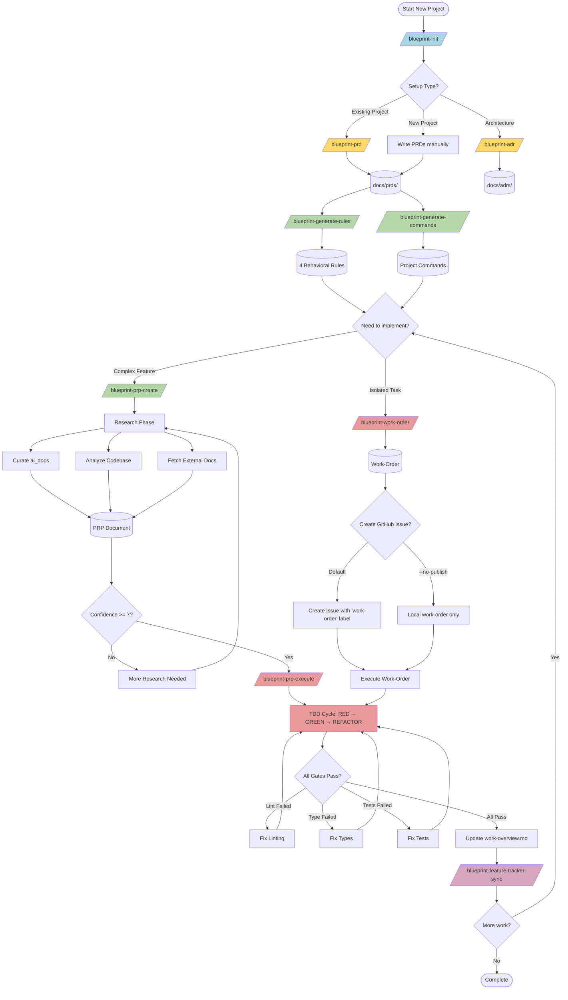
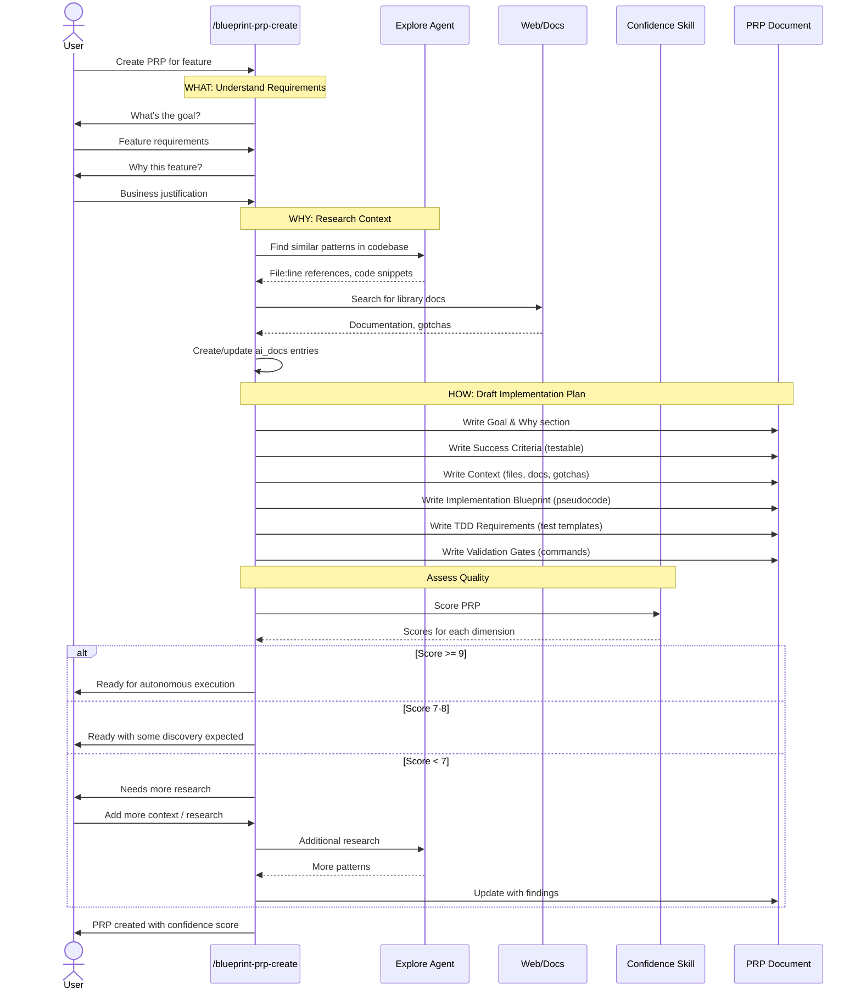
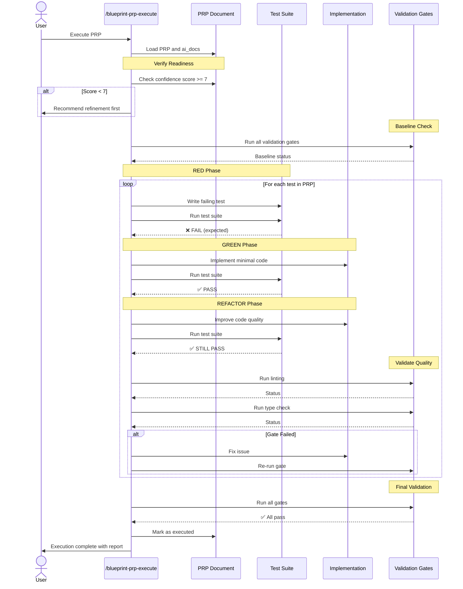
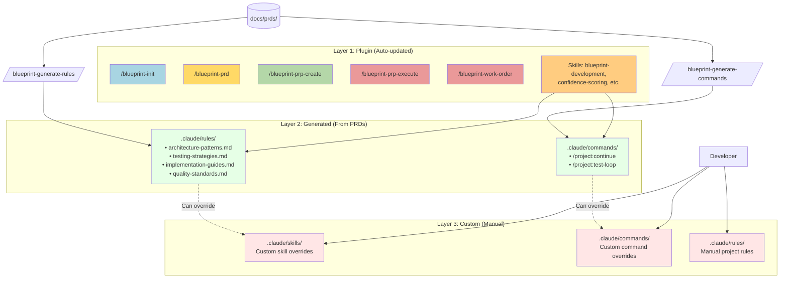

# Blueprint Plugin - Workflow Sequence Diagrams

This document provides Mermaid diagrams showing the Blueprint Plugin workflow from different perspectives.

## 1. High-Level Workflow

The complete journey from initialization to implementation:

## 2. PRP Creation Flow (What, Why, How)

Detailed view of PRP creation with research and confidence scoring:

## 3. PRP Execution Flow (TDD Cycle)

The RED → GREEN → REFACTOR workflow with validation gates:

## 4. Work-Order Creation and GitHub Integration

How work-orders connect to GitHub for team visibility:

```mermaid
graph LR
    subgraph "Work-Order Creation"
        A[/blueprint-work-order/] --> B{Mode?}
        B -->|Default| C[Analyze current state]
        B -->|--from-issue N| D[Fetch GitHub issue #N]

        C --> E[Determine next task]
        E --> F[Extract minimal context]
        F --> G[Create work-order NNN.md]

        D --> H[Parse issue content]
        H --> G

        G --> I{GitHub Integration?}
        I -->|Default| J[Create GitHub issue]
        I -->|--no-publish| K[Local only]

        J --> L["Label: 'work-order'"]
        L --> M[Link issue ↔ work-order]
    end

    subgraph "Execution & Tracking"
        M --> N[Execute work-order]
        K --> N
        N --> O[TDD Implementation]
        O --> P[Create Pull Request]
        P --> Q["PR body: 'Fixes #N'"]
        Q --> R[PR Review & Merge]
    end

    subgraph "Completion"
        R --> S[Issue auto-closes]
        R --> T[Move work-order to completed/]
        S --> U[Update feature-tracker]
        T --> U
    end

    style A fill:#ea9999
    style J fill:#90EE90
    style P fill:#FFD700
    style S fill:#87CEEB
```

## 5. Skills and Their Triggers

When each skill is activated:

```mermaid
graph TD
    subgraph Skills
        BD[blueprint-development]
        CS[confidence-scoring]
        FT[feature-tracking]
        DD[document-detection]
        MG[blueprint-migration]
    end

    subgraph Triggers
        T1["User runs /blueprint-generate-rules"] --> BD
        T2["User runs /blueprint-generate-commands"] --> BD

        T3["Creating PRP"] --> CS
        T4["Creating work-order"] --> CS

        T5["Running /blueprint-feature-tracker-sync"] --> FT
        T6["Running /blueprint-feature-tracker-status"] --> FT

        T7["New feature discussed"] --> DD
        T8["Architecture decision made"] --> DD

        T9["Running /blueprint-upgrade"] --> MG
    end

    subgraph Actions
        BD --> A1["Generate 4 behavioral rules\nfrom PRDs"]
        BD --> A2["Create project-specific\nworkflow commands"]

        CS --> A3["Score Context Completeness"]
        CS --> A4["Score Implementation Clarity"]
        CS --> A5["Score Gotchas Documentation"]
        CS --> A6["Score Validation Coverage"]

        FT --> A7["Track FR codes"]
        FT --> A8["Calculate completion %"]
        FT --> A9["Sync with work-overview"]

        DD --> A10["Suggest PRD creation"]
        DD --> A11["Suggest ADR creation"]
        DD --> A12["Suggest PRP creation"]

        MG --> A13["Migrate v1.x → v2.0"]
        MG --> A14["Migrate v2.x → v3.0"]
    end

    style BD fill:#ffcc80
    style CS fill:#ffcc80
    style FT fill:#ffcc80
    style DD fill:#ffcc80
    style MG fill:#ffcc80
```

## 6. Three-Layer Architecture

How the plugin, generated, and custom layers interact:

## Key Concepts

### WHAT
Blueprint Development is a **documentation-first development methodology** for AI-assisted coding. It structures the journey from requirements to implementation through a chain of progressively more detailed documents:

**PRD** (What & Why) → **PRP** (How, with context) → **Work-Order** (Isolated task) → **Implementation** (TDD)

### WHY
Traditional development loses context between planning and implementation. Blueprint Development creates **AI-optimized documentation** that:

- **Enforces TDD** from the start (tests specified in PRP/work-order)
- **Minimizes context** (only what's needed, curated)
- **Enables reproducibility** (validation gates are executable commands)
- **Provides transparency** (GitHub integration for team visibility)
- **Scales quality** (behavioral rules extracted from PRDs guide all code)

### HOW

1. **Initialize**: Set up directory structure and manifest
2. **Document**: Write PRDs (requirements) and ADRs (decisions)
3. **Generate**: Extract behavioral rules and workflow commands from PRDs
4. **Prepare**: Create PRPs with research (codebase analysis + external docs + confidence scoring)
5. **Execute**: TDD cycle (RED → GREEN → REFACTOR) with validation gates
6. **Track**: Monitor progress with feature tracker and work-overview

The workflow has **three layers**:
- **Plugin layer**: Generic commands from blueprint-plugin (auto-updated)
- **Generated layer**: Rules/commands extracted from your PRDs (regeneratable)
- **Custom layer**: Your project-specific overrides (manual)

This ensures you get **best practices from the plugin** + **project-specific patterns from your PRDs** + **flexibility to customize**.
