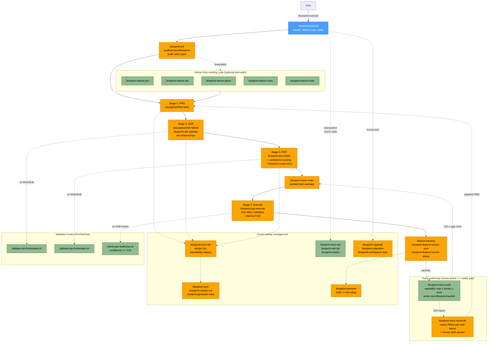

# Blueprint Plugin Flow

## Legend

| Node style | Meaning |
|------------|---------|
| Blue | Router skill (`/blueprint:execute`) |
| Green | Read-only analysis / listing / validation |
| Orange | Skills that create or mutate blueprint artefacts |
| Purple | Interactive `AskUserQuestion` prompt (none currently) |

Solid arrows are the main spine (PRD -> ADR -> PRP -> execute).
Dotted arrows are optional side-paths and cross-cutting concerns.

## Stage -> Skill mapping

| Stage | Skills |
|-------|--------|
| Bootstrap | `blueprint-init`, `blueprint-execute` (router) |
| Derive (brownfield) | `blueprint-derive-prd`, `blueprint-derive-adr`, `blueprint-derive-plans`, `blueprint-derive-rules`, `blueprint-derive-tests` |
| PRD | `blueprint-development`, `document-detection`, `document-linking` |
| ADR | `blueprint-adr-validate`, `blueprint-adr-list`, `adr-relationships` |
| PRP | `blueprint-prp-create`, `blueprint-curate-docs`, `confidence-scoring` |
| Execute | `blueprint-work-order`, `blueprint-prp-execute` |
| Feature tracking | `feature-tracking`, `blueprint-feature-tracker-sync`, `blueprint-feature-tracker-status` |
| Cross-cutting: IDs | `blueprint-sync-ids` |
| Cross-cutting: sync | `blueprint-sync`, `blueprint-claude-md`, `blueprint-generate-rules`, `blueprint-rules` |
| Cross-cutting: promote | `blueprint-promote` (child -> root monorepo rollup) |
| Cross-cutting: listing/status | `blueprint-docs-list`, `blueprint-adr-list`, `blueprint-status` |
| Cross-cutting: migration | `blueprint-upgrade`, `blueprint-migration`, `blueprint-workspace-scan` |
| Cross-cutting: docs hygiene | `blueprint-docs-currency` (advisory: same-commit code+docs landing) |
| Validation | `validate-prp-frontmatter.sh`, `validate-adr-frontmatter.sh`, `check-prp-readiness.sh` |
| Story-audit loop | `blueprint-story-audit` (read-only audit), `blueprint-story-reconcile` (PRD-only mutate) |
