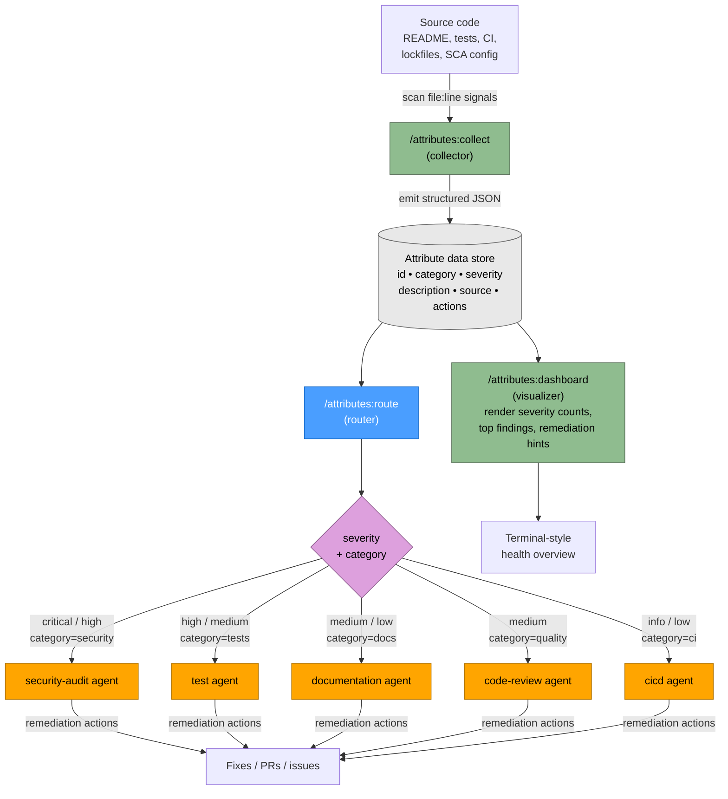

# Codebase Attributes Plugin Flow

## Legend

| Node style | Meaning |
|------------|---------|
| Blue | Router skill (`/attributes:route`) |
| Green | Read-only collector / visualizer skill |
| Orange | Downstream agent that may mutate code |
| Grey | Shared attribute data store (JSON) |
| Purple | Routing decision (severity + category) |

## Stage → Skill mapping

| Stage | Skill / Agent | Input | Output |
|-------|---------------|-------|--------|
| Collect | `/attributes:collect` | Source tree (README, tests, CI, lockfiles, linter config) | Attribute JSON: `{id, category, severity, description, source, actions}` keyed by `file:line` |
| Store | (in-memory / file artefact) | Collector output | Normalised attribute list consumed by router + dashboard |
| Route | `/attributes:route` | Attribute JSON | Agent delegations keyed by `(category, severity)` |
| Act | `security-audit`, `test`, `documentation`, `code-review`, `cicd` agents | Routed attributes + remediation `actions` | Fixes, PRs, issues |
| Visualize | `/attributes:dashboard` | Attribute JSON | Terminal health dashboard grouped by category and severity |

## Data contract

Attributes flowing between stages carry:

- **Location** — `file:line` (plus optional column) so downstream agents can jump straight to the offending site
- **Category** — `docs` · `tests` · `security` · `quality` · `ci`
- **Severity** — `critical` · `high` · `medium` · `low` · `info` (drives routing priority and dashboard colouring)
- **Actions** — array of `{agent, command, rationale}` entries; the router uses `agent` as its dispatch key

Integration: the `git-repo-agent` Python tool emits the same JSON schema, so it can substitute for `/attributes:collect` without changing downstream stages.
