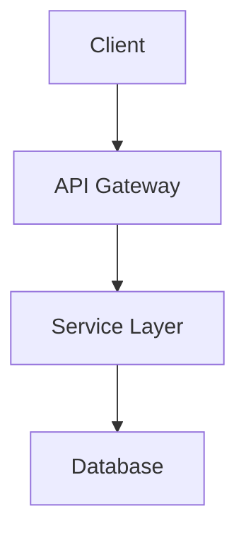

## Context

- Project root: !`pwd`
- Project name: !`basename $(pwd)`
- README exists: !`ls -la README.md 2>/dev/null || echo "Not found"`
- Package files: !`ls -la package.json pyproject.toml Cargo.toml go.mod 2>/dev/null || echo "None found"`
- Git remote: !`git remote get-url origin 2>/dev/null || echo "No remote"`
- License file: !`ls -la LICENSE* 2>/dev/null || echo "None found"`
- Assets directory: !`ls -d assets/ public/ images/ docs/assets/ 2>/dev/null || echo "None found"`
- Logo files: !`ls assets/logo* assets/icon* public/logo* images/logo* 2>/dev/null || echo "None found"`

## Parameters

Parse from command arguments:

- `--check-only`: Report README compliance status without modifications (CI/CD mode)
- `--fix`: Apply fixes automatically without prompting
- `--style <minimal|standard|detailed>`: README detail level (default: standard)
- `--badges <shields|custom>`: Badge style preference (default: shields)
- `--no-logo`: Skip logo section even if assets exist

**Style Levels:**
- `minimal`: Title, description, badges, basic install/usage
- `standard`: Logo, badges, features, tech stack, getting started, license (recommended)
- `detailed`: All of standard plus: architecture diagram, API reference, contributing guide, changelog link

## Your Task

Generate a professional README.md following project standards, with proper branding, badges, and documentation structure inspired by best practices.

### Phase 1: Project Detection

Detect project metadata from multiple sources:

**From package.json (JavaScript/TypeScript):**
```javascript
{
  "name": "project-name",
  "description": "Project description",
  "version": "1.0.0",
  "license": "MIT",
  "repository": { "url": "github:owner/repo" },
  "keywords": ["keyword1", "keyword2"]
}
```

**From pyproject.toml (Python):**
```toml
[project]
name = "project-name"
description = "Project description"
version = "1.0.0"
license = "MIT"
keywords = ["keyword1", "keyword2"]

[project.urls]
Repository = "https://github.com/owner/repo"
```

**From Cargo.toml (Rust):**
```toml
[package]
name = "project-name"
description = "Project description"
version = "1.0.0"
license = "MIT"
repository = "https://github.com/owner/repo"
keywords = ["keyword1", "keyword2"]
```

**From go.mod (Go):**
```
module github.com/owner/repo
```

**Fallback detection:**
- Project name: directory name
- Description: first line of existing README or ask user
- Repository: git remote URL
- License: LICENSE file content

### Phase 2: Current State Analysis

Check existing README.md for:

- [ ] Logo/icon present (centered image at top)
- [ ] Project title (h1)
- [ ] Description/tagline
- [ ] Badges row (license, version, CI status, coverage)
- [ ] Features section
- [ ] Tech Stack section
- [ ] Prerequisites section
- [ ] Installation instructions
- [ ] Usage examples
- [ ] Project structure
- [ ] Contributing guidelines
- [ ] License section

**Asset Discovery:**
Check for logo/icon files in common locations:
- `assets/logo.png`, `assets/icon.png`, `assets/logo.svg`
- `public/logo.png`, `public/icon.svg`
- `images/logo.png`, `docs/assets/logo.png`
- `.github/logo.png`, `.github/images/logo.png`

### Phase 3: Compliance Report

Generate formatted compliance report:

```
README.md Compliance Report
===========================
Project: [name]
Style Level: [minimal|standard|detailed]

Structure:
  Logo/Icon              [✅ PASS | ❌ MISSING | ⏭️ N/A (no assets)]
  Title                  [✅ PASS | ❌ MISSING]
  Description            [✅ PASS | ❌ MISSING | ⚠️ TOO SHORT]
  Badges                 [✅ PASS | ⚠️ PARTIAL | ❌ MISSING]
  Features               [✅ PASS | ❌ MISSING]
  Tech Stack             [✅ PASS | ❌ MISSING]
  Getting Started        [✅ PASS | ⚠️ INCOMPLETE | ❌ MISSING]
  Project Structure      [✅ PASS | ❌ MISSING | ⏭️ N/A (small project)]
  License                [✅ PASS | ❌ MISSING]

Content Quality:
  Has code examples      [✅ YES | ❌ NO]
  Commands are correct   [✅ YES | ⚠️ OUTDATED]
  Links are valid        [✅ YES | ⚠️ BROKEN LINKS]

Overall: [X issues found]
```

### Phase 4: Configuration (if --fix or user confirms)

#### README.md Template (Standard Style)

Generate README following this structure:

```markdown
<div align="center">


# PROJECT_NAME

**TAGLINE_DESCRIPTION**

[](LICENSE)
[](https://github.com/OWNER/REPO/stargazers)
[](https://github.com/OWNER/REPO/actions)
[]()

</div>

## Features

- **Feature 1** - Description of the first key feature
- **Feature 2** - Description of the second key feature
- **Feature 3** - Description of the third key feature
- **Feature 4** - Description of the fourth key feature

## Tech Stack

| Category | Technology |
|----------|------------|
| Runtime | Node.js / Bun / Python / Rust |
| Framework | Express / Fastify / FastAPI / Axum |
| Database | PostgreSQL / SQLite / MongoDB |
| Testing | Vitest / pytest / cargo-nextest |

## Getting Started

### Prerequisites

- [Prerequisite 1](link) >= version
- [Prerequisite 2](link) >= version

### Installation

```bash
# Clone the repository
git clone https://github.com/OWNER/REPO.git
cd REPO

# Install dependencies
INSTALL_COMMAND

# Run the application
RUN_COMMAND
```

### Usage

```bash
# Example command
EXAMPLE_COMMAND
```

## Project Structure

```
PROJECT_NAME/
├── src/               # Source code
│   ├── components/    # UI components (if applicable)
│   └── services/      # Business logic
├── tests/             # Test files
├── docs/              # Documentation
└── README.md
```

## Development

```bash
# Run tests
TEST_COMMAND

# Run linter
LINT_COMMAND

# Build for production
BUILD_COMMAND
```

## Contributing

Contributions are welcome! Please read our [Contributing Guidelines](CONTRIBUTING.md) before submitting a PR.

## License

This project is licensed under the [LICENSE_TYPE](LICENSE) license.
```

#### Badge Generation

**Standard Shields.io badges:**

| Badge Type | URL Pattern |
|------------|-------------|
| License | `https://img.shields.io/github/license/OWNER/REPO` |
| Stars | `https://img.shields.io/github/stars/OWNER/REPO` |
| Forks | `https://img.shields.io/github/forks/OWNER/REPO` |
| Issues | `https://img.shields.io/github/issues/OWNER/REPO` |
| CI Status | `https://img.shields.io/github/actions/workflow/status/OWNER/REPO/WORKFLOW.yml` |
| Version | `https://img.shields.io/github/v/release/OWNER/REPO` |
| npm | `https://img.shields.io/npm/v/PACKAGE` |
| PyPI | `https://img.shields.io/pypi/v/PACKAGE` |
| Crates.io | `https://img.shields.io/crates/v/PACKAGE` |

**Runtime/Tech badges:**

| Technology | Badge URL |
|------------|-----------|
| Bun | `https://img.shields.io/badge/runtime-Bun-f9f1e1` |
| Node.js | `https://img.shields.io/badge/node-%3E%3D20-brightgreen` |
| TypeScript | `https://img.shields.io/badge/TypeScript-5.x-blue` |
| Python | `https://img.shields.io/badge/python-3.12-blue` |
| Rust | `https://img.shields.io/badge/rust-1.75+-orange` |
| Go | `https://img.shields.io/badge/go-1.22-00ADD8` |

### Phase 5: Logo/Asset Handling

If no logo exists but user wants one:

1. **Check for existing assets** in standard locations
2. **Suggest creating** a simple text-based logo or using a placeholder
3. **Create assets directory** if needed: `mkdir -p assets`

**Placeholder logo suggestion:**
```markdown
<div align="center">
<h1>🚀 PROJECT_NAME</h1>
</div>
```

Or suggest tools:
- [Shields.io](https://shields.io) for custom badges
- [Simple Icons](https://simpleicons.org) for technology icons
- AI image generators for custom logos

### Phase 6: Command Detection

Auto-detect project commands based on package manager/build tool:

**JavaScript/TypeScript (package.json):**
```json
{
  "scripts": {
    "dev": "...",      -> Development command
    "build": "...",    -> Build command
    "test": "...",     -> Test command
    "lint": "..."      -> Lint command
  }
}
```

**Python (pyproject.toml with uv/poetry):**
- Install: `uv sync` or `poetry install`
- Run: `uv run python -m package` or `poetry run python -m package`
- Test: `uv run pytest` or `poetry run pytest`

**Rust (Cargo.toml):**
- Build: `cargo build`
- Run: `cargo run`
- Test: `cargo test`

**Go (go.mod):**
- Build: `go build`
- Run: `go run .`
- Test: `go test ./...`

### Phase 7: Project Structure Generation

Generate accurate project structure based on actual directory layout:

```bash
# Use tree or find to generate structure
tree -L 2 -I 'node_modules|target|__pycache__|.git|dist|build' --dirsfirst
```

Include only relevant directories, skip:
- `node_modules/`, `vendor/`
- `target/`, `dist/`, `build/`
- `__pycache__/`, `.pytest_cache/`
- `.git/`, `.venv/`, `venv/`

### Phase 8: Standards Tracking

Update `.project-standards.yaml`:

```yaml
standards_version: "2025.1"
project_type: "[detected]"
last_configured: "[timestamp]"
components:
  readme: "2025.1"
  readme_style: "[minimal|standard|detailed]"
  readme_has_logo: true|false
  readme_badges: ["license", "stars", "ci", "version"]
```

### Phase 9: Validation

After generating README, validate:

1. **Markdown lint** - Check for syntax errors
2. **Link validation** - Verify all links are accessible (warn only)
3. **Badge URLs** - Ensure shields.io URLs are correctly formatted
4. **Image paths** - Verify logo/image paths exist

### Phase 10: Updated Compliance Report

```
README.md Compliance Report (After Configuration)
=================================================
Project: [name]
Style Level: [minimal|standard|detailed]

Changes Made:
  ✅ Added centered logo section
  ✅ Generated badge row (license, stars, CI)
  ✅ Created Features section with 4 highlights
  ✅ Added Tech Stack table
  ✅ Generated Getting Started with correct commands
  ✅ Created Project Structure from actual layout
  ✅ Added License section

README Location: ./README.md
Preview: Open in VS Code or view on GitHub

Next Steps:
  - Review and customize feature descriptions
  - Add a logo image to assets/ (optional)
  - Run `/configure:github-pages` to publish documentation
  - Consider adding CONTRIBUTING.md and CHANGELOG.md
```

## Detailed Style Additions

When `--style detailed` is specified, also include:

### Architecture Section
```markdown
## Architecture


```

### API Reference Link
```markdown
## API Reference

See the [API Documentation](docs/api.md) for detailed endpoint information.
```

### Changelog Link
```markdown
## Changelog

See [CHANGELOG.md](CHANGELOG.md) for version history.
```

## Output

Provide:
1. Compliance report with section-by-section status
2. Generated or updated README.md content
3. List of detected project metadata
4. Suggestions for improvement (logo, more features, etc.)

## See Also

- `/configure:docs` - Configure code documentation standards
- `/configure:github-pages` - Set up documentation hosting
- `/configure:all` - Run all compliance checks
- **readme-standards** skill for README templates and examples
