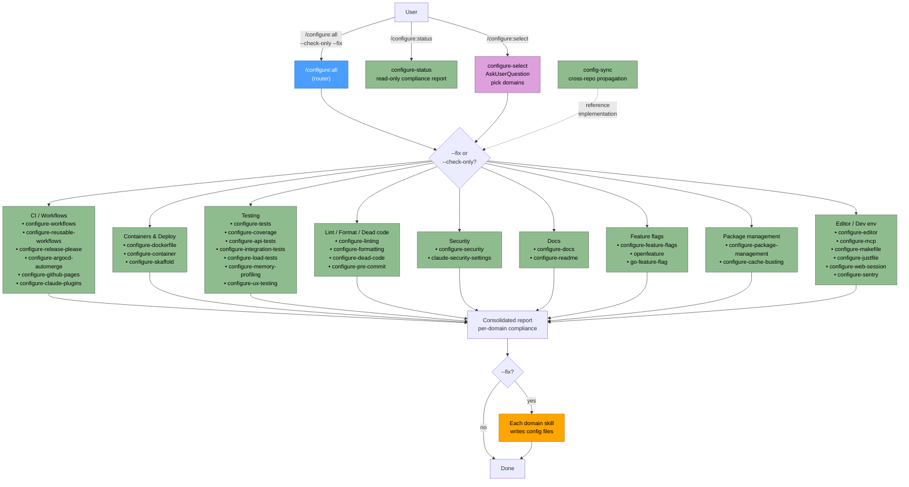

# Configure Plugin Flow

## Legend

| Node style | Meaning |
|------------|---------|
| Blue | Router skill (`/configure:all`) |
| Green | Read-only audit / domain group (`--check-only`) |
| Orange | Fix application (`--fix` writes config files) |
| Purple | Interactive `AskUserQuestion` prompt |

## Domain → Skill mapping

| Domain | Skills |
|--------|--------|
| CI / Workflows | `configure-workflows`, `configure-reusable-workflows`, `configure-release-please`, `configure-argocd-automerge`, `configure-github-pages`, `configure-claude-plugins`, `ci-workflows`, `release-please-standards` |
| Containers & Deploy | `configure-dockerfile`, `configure-container`, `configure-skaffold`, `skaffold-standards` |
| Testing | `configure-tests`, `configure-coverage`, `configure-api-tests`, `configure-integration-tests`, `configure-load-tests`, `configure-memory-profiling`, `configure-ux-testing` |
| Lint / Format / Dead code | `configure-linting`, `configure-formatting`, `configure-dead-code`, `configure-pre-commit`, `pre-commit-standards` |
| Security | `configure-security`, `claude-security-settings` |
| Docs | `configure-docs`, `configure-readme`, `readme-standards` |
| Feature flags | `configure-feature-flags`, `openfeature`, `go-feature-flag` |
| Package management | `configure-package-management`, `configure-cache-busting` |
| Editor / Dev env | `configure-editor`, `configure-mcp`, `configure-makefile`, `configure-justfile`, `configure-web-session`, `configure-sentry` |
| Orchestration | `configure-all` (router), `configure-select` (interactive), `configure-status` (read-only), `config-sync` (cross-repo) |
