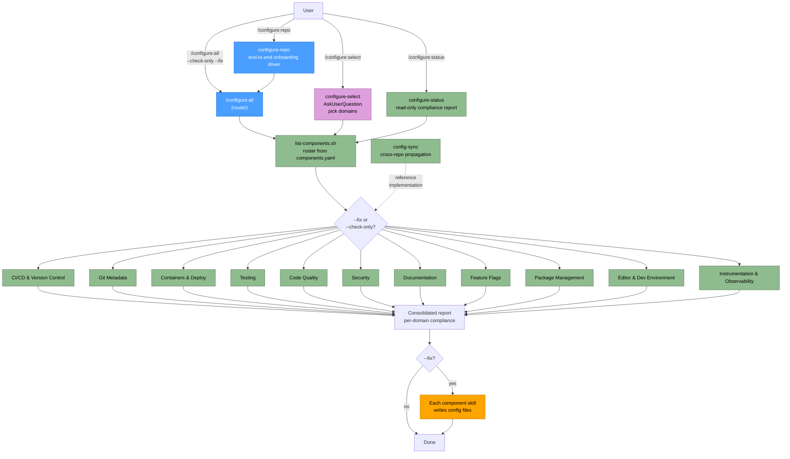

# Configure Plugin Flow

The component roster and domain grouping below are generated from the
authoritative manifest
[`skills/configure-all/components.yaml`](../skills/configure-all/components.yaml).
`scripts/check-configure-components.sh` (repo root) fails CI when this file
and the manifest disagree — update the manifest first.

## Legend

| Node style | Meaning |
|------------|---------|
| Blue | Router / driver skill (`/configure:all`, `/configure:repo`) |
| Green | Read-only audit / domain group (`--check-only`) |
| Orange | Fix application (`--fix` writes config files) |
| Purple | Interactive `AskUserQuestion` prompt |

## Domain → Skill mapping

Component columns mirror `components.yaml`; reference skills
(`user-invocable: false` knowledge bases) are listed with their domain.

| Domain | Component skills | Reference skills |
|--------|------------------|------------------|
| CI/CD & Version Control | `configure-workflows`, `configure-reusable-workflows`, `configure-release-please`, `configure-pre-commit`, `configure-github-pages`, `configure-argocd-automerge`, `configure-claude-plugins` | `ci-workflows`, `release-please-standards`, `pre-commit-standards` |
| Git Metadata | `configure-gitattributes`, `configure-gitignore`, `configure-worktreeinclude` | |
| Containers & Deploy | `configure-dockerfile`, `configure-container`, `configure-skaffold` | `skaffold-standards` |
| Testing | `configure-tests`, `configure-coverage`, `configure-api-tests`, `configure-integration-tests`, `configure-load-tests`, `configure-memory-profiling`, `configure-ux-testing` | |
| Code Quality | `configure-linting`, `configure-formatting`, `configure-dead-code` | |
| Security | `configure-security` | `claude-security-settings` |
| Documentation | `configure-docs`, `configure-readme`, `configure-surface` | `readme-standards` |
| Feature Flags | `configure-feature-flags` | `openfeature`, `go-feature-flag` |
| Package Management | `configure-package-management`, `configure-mise`, `configure-cache-busting` | |
| Editor & Dev Environment | `configure-editor`, `configure-mcp`, `configure-makefile`, `configure-justfile`, `configure-web-session` | |
| Instrumentation & Observability | `configure-instrumentation`, `configure-sentry` | |
| Orchestration | `configure-all` (router), `configure-select` (interactive), `configure-status` (read-only), `configure-repo` (onboarding driver), `config-sync` (cross-repo) | `multi-repo-discipline` (advisory) |
