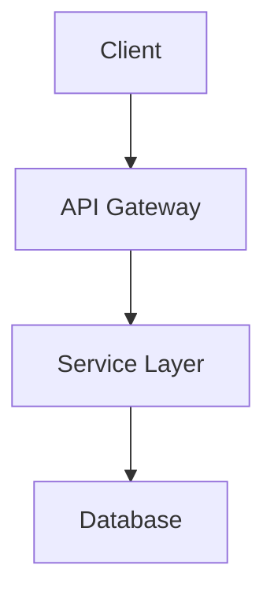

# configure-readme Reference

## Package File Format Examples

### package.json (JavaScript/TypeScript)

```javascript
{
  "name": "project-name",
  "description": "Project description",
  "version": "1.0.0",
  "license": "MIT",
  "repository": { "url": "github:owner/repo" },
  "keywords": ["keyword1", "keyword2"]
}
```

### pyproject.toml (Python)

```toml
[project]
name = "project-name"
description = "Project description"
version = "1.0.0"
license = "MIT"
keywords = ["keyword1", "keyword2"]

[project.urls]
Repository = "https://github.com/owner/repo"
```

### Cargo.toml (Rust)

```toml
[package]
name = "project-name"
description = "Project description"
version = "1.0.0"
license = "MIT"
repository = "https://github.com/owner/repo"
keywords = ["keyword1", "keyword2"]
```

### go.mod (Go)

```
module github.com/owner/repo
```

## Compliance Report Format

```
README.md Compliance Report
===========================
Project: [name]
Style Level: [minimal|standard|detailed]

Structure:
  Logo/Icon              [PASS | MISSING | N/A (no assets)]
  Title                  [PASS | MISSING]
  Description            [PASS | MISSING | TOO SHORT]
  Badges                 [PASS | PARTIAL | MISSING]
  Features               [PASS | MISSING]
  Tech Stack             [PASS | MISSING]
  Getting Started        [PASS | INCOMPLETE | MISSING]
  Project Structure      [PASS | MISSING | N/A (small project)]
  License                [PASS | MISSING]

Content Quality:
  Has code examples      [YES | NO]
  Commands are correct   [YES | OUTDATED]
  Links are valid        [YES | BROKEN LINKS]

Overall: [X issues found]
```

## README Template (Standard Style)

```markdown
<div align="center">


# PROJECT_NAME

**TAGLINE_DESCRIPTION**

[](LICENSE)
[](https://github.com/OWNER/REPO/stargazers)
[](https://github.com/OWNER/REPO/actions)
[]()

</div>

## Features

- **Feature 1** - Description of the first key feature
- **Feature 2** - Description of the second key feature
- **Feature 3** - Description of the third key feature
- **Feature 4** - Description of the fourth key feature

## Tech Stack

| Category | Technology |
|----------|------------|
| Runtime | Node.js / Bun / Python / Rust |
| Framework | Express / Fastify / FastAPI / Axum |
| Database | PostgreSQL / SQLite / MongoDB |
| Testing | Vitest / pytest / cargo-nextest |

## Getting Started

### Prerequisites

- [Prerequisite 1](link) >= version
- [Prerequisite 2](link) >= version

### Installation

```bash
# Clone the repository
git clone https://github.com/OWNER/REPO.git
cd REPO

# Install dependencies
INSTALL_COMMAND

# Run the application
RUN_COMMAND
```

### Usage

```bash
# Example command
EXAMPLE_COMMAND
```

## Project Structure

```
PROJECT_NAME/
├── src/               # Source code
│   ├── components/    # UI components (if applicable)
│   └── services/      # Business logic
├── tests/             # Test files
├── docs/              # Documentation
└── README.md
```

## Development

```bash
# Run tests
TEST_COMMAND

# Run linter
LINT_COMMAND

# Build for production
BUILD_COMMAND
```

## Contributing

Contributions are welcome! Please read our [Contributing Guidelines](CONTRIBUTING.md) before submitting a PR.

## License

This project is licensed under the [LICENSE_TYPE](LICENSE) license.
```

## Badge URL Patterns

### Standard Shields.io Badges

| Badge Type | URL Pattern |
|------------|-------------|
| License | `https://img.shields.io/github/license/OWNER/REPO` |
| Stars | `https://img.shields.io/github/stars/OWNER/REPO` |
| Forks | `https://img.shields.io/github/forks/OWNER/REPO` |
| Issues | `https://img.shields.io/github/issues/OWNER/REPO` |
| CI Status | `https://img.shields.io/github/actions/workflow/status/OWNER/REPO/WORKFLOW.yml` |
| Version | `https://img.shields.io/github/v/release/OWNER/REPO` |
| npm | `https://img.shields.io/npm/v/PACKAGE` |
| PyPI | `https://img.shields.io/pypi/v/PACKAGE` |
| Crates.io | `https://img.shields.io/crates/v/PACKAGE` |

### Runtime/Tech Badges

| Technology | Badge URL |
|------------|-----------|
| Bun | `https://img.shields.io/badge/runtime-Bun-f9f1e1` |
| Node.js | `https://img.shields.io/badge/node-%3E%3D20-brightgreen` |
| TypeScript | `https://img.shields.io/badge/TypeScript-5.x-blue` |
| Python | `https://img.shields.io/badge/python-3.12-blue` |
| Rust | `https://img.shields.io/badge/rust-1.75+-orange` |
| Go | `https://img.shields.io/badge/go-1.22-00ADD8` |

## Placeholder Logo

When no logo exists:

```markdown
<div align="center">
<h1>PROJECT_NAME</h1>
</div>
```

Tools for creating logos:
- [Shields.io](https://shields.io) for custom badges
- [Simple Icons](https://simpleicons.org) for technology icons
- AI image generators for custom logos

## Results Report Format

```
README.md Compliance Report (After Configuration)
=================================================
Project: [name]
Style Level: [minimal|standard|detailed]

Changes Made:
  Added centered logo section
  Generated badge row (license, stars, CI)
  Created Features section with 4 highlights
  Added Tech Stack table
  Generated Getting Started with correct commands
  Created Project Structure from actual layout
  Added License section

README Location: ./README.md
Preview: Open in VS Code or view on GitHub

Next Steps:
  - Review and customize feature descriptions
  - Add a logo image to assets/ (optional)
  - Run /configure:github-pages to publish documentation
  - Consider adding CONTRIBUTING.md and CHANGELOG.md
```

## Detailed Style Additions

When `--style detailed` is specified, also include:

### Architecture Section

```markdown
## Architecture


```

### API Reference Link

```markdown
## API Reference

See the [API Documentation](docs/api.md) for detailed endpoint information.
```

### Changelog Link

```markdown
## Changelog

See [CHANGELOG.md](CHANGELOG.md) for version history.
```
