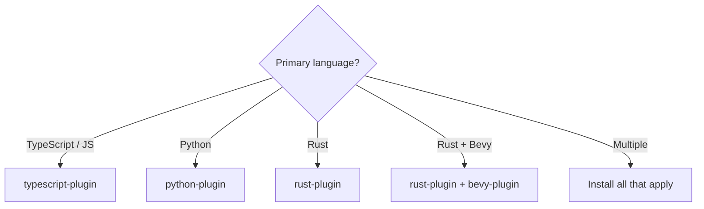
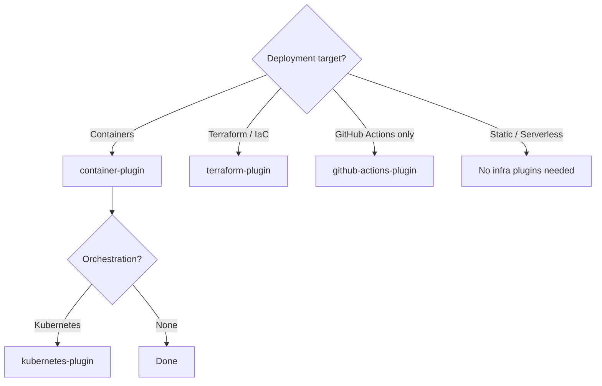
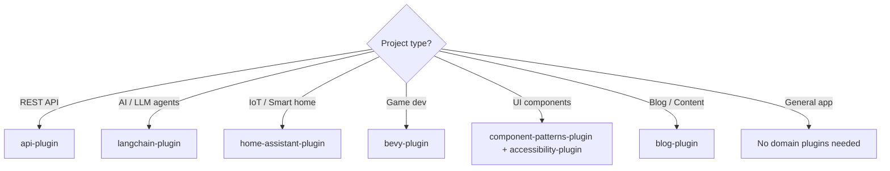

# Plugin Navigation Map

Navigation guide for 32 plugins and 289+ skills. Start here.

## Quick Start

| Intent | Commands | What happens |
|--------|----------|--------------|
| Diagnose setup | `/health:check` then `/health:audit` | Scans config, recommends plugins for your stack |
| New project | `/project:init` then `/blueprint:init` | Scaffolds project, creates PRD |
| Resume work | `/blueprint:execute` | Analyzes repo state, picks next action, runs it |

`/blueprint:execute` is the single auto-pilot command. It determines what to do next (PRD, ADR, PRP, implement, test, commit) and does it.

## Setup Sequence

Install in tier order. Each tier builds on the previous.

### Tier 0 - Foundation

Install these first. They configure the environment other plugins rely on.

| Plugin | Skills | Purpose |
|--------|--------|---------|
| health-plugin | 6 | Diagnose config issues, audit plugin selection |
| hooks-plugin | 1 | Enforce best practices via lifecycle hooks |
| configure-plugin | 42 | Infrastructure standards (CI, linting, testing, Docker) |
| agent-patterns-plugin | 16 | Agent orchestration, MCP management, delegation |

### Tier 1 - Core Workflow

The development loop: plan, code, commit, ship.

| Plugin | Skills | Purpose |
|--------|--------|---------|
| blueprint-plugin | 30 | PRD/ADR/PRP methodology, `/blueprint:execute` auto-pilot |
| git-plugin | 27 + 1 agent | Commits, branches, PRs, worktrees, release-please |
| project-plugin | 6 | Project init, modernization, maintenance |
| agents-plugin | 1 + 10 agents | Task delegation to specialized agents |

### Tier 2 - Quality Gates

Automated quality enforcement.

| Plugin | Skills | Purpose |
|--------|--------|---------|
| testing-plugin | 15 | Test execution, TDD, Vitest, Playwright, mutation testing |
| code-quality-plugin | 13 | Review, refactoring, linting, ast-grep, debugging |
| documentation-plugin | 5 | API docs, README generation, knowledge graphs |

### Tier 3+ - Pick What Applies

See [decision trees](#pick-your-stack) and [conditional plugins](#conditional-plugins) below.

## Plugin Relationship Diagram

> Render locally: `d2 -l elk docs/diagrams/plugin-relationships.d2 docs/diagrams/plugin-relationships.svg`

## Pick Your Stack

### Language

### Infrastructure

### Domain

## Project Presets

Pre-assembled plugin lists for common project types. Foundation + Core + Quality are always included.

### Python Web API

| Tier | Plugins |
|------|---------|
| Foundation | health, hooks, configure, agent-patterns |
| Core | blueprint, git, project, agents |
| Quality | testing, code-quality, documentation |
| Stack | python-plugin, container-plugin, github-actions-plugin |
| Optional | api-plugin, terraform-plugin, kubernetes-plugin |

### TypeScript / Node.js App

| Tier | Plugins |
|------|---------|
| Foundation | health, hooks, configure, agent-patterns |
| Core | blueprint, git, project, agents |
| Quality | testing, code-quality, documentation |
| Stack | typescript-plugin, container-plugin, github-actions-plugin |
| Optional | component-patterns-plugin, accessibility-plugin, langchain-plugin |

### Rust CLI / Library

| Tier | Plugins |
|------|---------|
| Foundation | health, hooks, configure, agent-patterns |
| Core | blueprint, git, project, agents |
| Quality | testing, code-quality, documentation |
| Stack | rust-plugin |
| Optional | container-plugin, github-actions-plugin |

### Infrastructure / DevOps

| Tier | Plugins |
|------|---------|
| Foundation | health, hooks, configure, agent-patterns |
| Core | blueprint, git, project, agents |
| Quality | testing, code-quality, documentation |
| Stack | terraform-plugin, container-plugin, kubernetes-plugin, github-actions-plugin |
| Optional | networking-plugin, finops-plugin |

## Always-Install Plugins

These apply to every project regardless of stack.

| Plugin | Why |
|--------|-----|
| health-plugin | Environment diagnostics and plugin auditing |
| hooks-plugin | Enforce best practices automatically |
| configure-plugin | Infrastructure standards baseline |
| agent-patterns-plugin | Agent orchestration for any workflow |
| blueprint-plugin | PRD/ADR/PRP methodology |
| git-plugin | Version control is universal |
| project-plugin | Project lifecycle management |
| agents-plugin | Specialized task delegation |
| testing-plugin | Every project needs tests |

## Conditional Plugins

Install based on your project's tech stack and domain.

| Plugin | Install when... |
|--------|-----------------|
| code-quality-plugin | You want code review, refactoring, linting automation |
| documentation-plugin | You need generated docs, knowledge graphs |
| typescript-plugin | Project uses TypeScript or JavaScript |
| python-plugin | Project uses Python |
| rust-plugin | Project uses Rust |
| bevy-plugin | Game development with Bevy engine |
| container-plugin | Project uses Docker containers |
| kubernetes-plugin | Deploying to Kubernetes clusters |
| terraform-plugin | Managing infrastructure as code |
| github-actions-plugin | CI/CD with GitHub Actions |
| finops-plugin | Optimizing GitHub Actions costs |
| networking-plugin | Network diagnostics or load testing needed |
| api-plugin | Building or testing REST APIs |
| langchain-plugin | Building AI agents with LangChain/LangGraph |
| home-assistant-plugin | Home Assistant configuration management |
| blog-plugin | Writing project logs or technical posts |
| communication-plugin | Formatting for Google Chat or ticket drafting |
| accessibility-plugin | WCAG compliance and ARIA patterns |
| component-patterns-plugin | Reusable UI component patterns |
| command-analytics-plugin | Tracking skill/command usage metrics |
| tools-plugin | fd, rg, jq, shell, ImageMagick, d2 utilities |
| workflow-orchestration-plugin | Parallel agent orchestration, CI pipelines, preflight checks, checkpoint refactoring |

## Key Entry Points

Commands organized by workflow phase.

| Phase | Command | Purpose |
|-------|---------|---------|
| **Diagnose** | `/health:check` | Scan Claude Code configuration |
| **Diagnose** | `/health:audit` | Recommend plugins for your stack |
| **Setup** | `/project:init` | Scaffold new project |
| **Setup** | `/configure:status` | Check infrastructure compliance |
| **Setup** | `/configure:all` | Apply all infrastructure standards |
| **Plan** | `/blueprint:init` | Create PRD for new feature |
| **Plan** | `/blueprint:execute` | Auto-pilot: determine and run next step |
| **Code** | `/test:run` | Run test suite |
| **Code** | `/test:quick` | Fast unit tests only |
| **Code** | `/lint-check` | Run appropriate linter |
| **Ship** | `/git:commit` | Commit with conventional message |
| **Ship** | `/git:pr` | Create pull request |
| **Ship** | `/git:fix-pr` | Fix failing PR checks |
| **Orchestrate** | `/workflow:preflight` | Pre-work validation before starting |
| **Orchestrate** | `/workflow:parallel-issues` | Process issues in parallel with worktrees |
| **Orchestrate** | `/workflow:ci-fix` | Fix failing CI across PRs |
| **Orchestrate** | `/workflow:checkpoint-refactor` | Multi-phase refactoring with checkpoints |
| **Monitor** | `/analytics-report` | View skill usage analytics |

## End-to-End Workflow

The full development loop using plugins:

1. `/health:check` - Verify environment is healthy
2. `/configure:status` - Check infrastructure standards
3. `/blueprint:init` - Create PRD for the feature
4. `/blueprint:execute` - Auto-pilot takes over:
   - Creates ADR for architectural decisions
   - Creates PRP (implementation plan)
   - Implements code changes
   - Runs tests via testing-plugin
   - Commits via git-plugin
   - Creates PR
5. Loop back to step 4 for the next feature

At any point, run `/blueprint:execute` to resume. It reads repo state and picks up where you left off.
