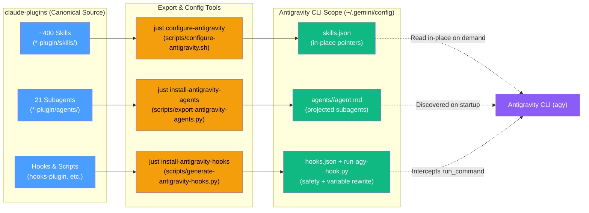

# Antigravity CLI (`agy`): In-Place Skills, Agent & Hook Export

Run this marketplace's skills, subagents, and safety hooks inside Google
[Antigravity CLI](https://antigravity.google) (`agy`).

Following the architecture established in [ADR-0022](adrs/0022-adapter-over-export-for-foreign-harnesses.md) and alongside sibling integrations ([`opencode-export.md`](opencode-export.md) and [`pi-export.md`](pi-export.md)), Antigravity CLI integration bridges the three customization surfaces cleanly:

| Surface | How it reaches Antigravity CLI | Why |
|---|---|---|
| **Skills** | In-place discovery via `skills.json` ([`scripts/configure-antigravity.sh`](../scripts/configure-antigravity.sh)) | Antigravity CLI natively discovers skills in `skills/<name>/SKILL.md` format and reads a full skill body on demand. Configuring `skills.json` reads all ~400 skills in-place with **zero copying and zero drift**. The standing cost of its skill listing has not been measured (pi and OpenCode, unadapted, cost ~111 and ~88 tokens per skill). |
| **Subagents** | Markdown agent projection ([`scripts/export-antigravity-agents.py`](../scripts/export-antigravity-agents.py)) | Antigravity CLI discovers custom agents from `agents/<name>/agent.md`. The generator projects all 21 marketplace subagents with model tier mapping (`opus` → `pro`, `sonnet` → `flash`, `haiku` → `flash_lite`) and sets `inheritCustomizations: true`. |
| **Hooks** | Lifecycle hook suite + variable rewriter ([`scripts/generate-antigravity-hooks.py`](../scripts/generate-antigravity-hooks.py)) | Antigravity CLI evaluates `hooks.json` on `PreToolUse`. The generator projects the safety allowlist shared with the pi export (branch protection, deletion guards, secret protection) and emulates `${CLAUDE_SKILL_DIR}`, `${CLAUDE_PLUGIN_ROOT}`, and `${CLAUDE_SESSION_ID}` by prepending exports via `overwrite.CommandLine`. |

`just setup-antigravity` runs the configuration and installation in one shot.

---

## Pipeline Overview



The dotted edge is key: skills are **read in place** from this checkout. Nothing is copied into cache or plugin duplicates, so local skill edits are live immediately.

---

## 1. Skills: In-Place `skills.json`

Antigravity CLI supports registering external skill directories via `skills.json` placed in your customization root (`~/.gemini/config/skills.json` globally or `<workspace>/.agents/skills.json` for a project).

Run:
```bash
just configure-antigravity       # registers all plugin skill dirs in ~/.gemini/config/skills.json
just unconfigure-antigravity     # removes them cleanly
```

This generates:
```json
{
  "entries": [
    { "path": "/abs/path/to/claude-plugins/git-plugin/skills" },
    { "path": "/abs/path/to/claude-plugins/typescript-plugin/skills" }
  ]
}
```

### Why in-place `skills.json` over `agy plugin install .`?

While `agy plugin install .` is supported by the CLI binary, it copies all 45 plugin directories (~400 files) into `~/.gemini/config/plugins/`. That creates 45 duplicate folders that drift whenever you edit a skill or switch branches.

`configure-antigravity` writes path entries pointing directly into this repository checkout:
- **Zero copying**: Files stay where they are.
- **Zero drift**: Changes made to any `SKILL.md` are immediately picked up on the next turn.
- **On-demand bodies**: Antigravity loads a full skill body only when the skill is activated. How many tokens its up-front listing of ~400 skills costs has not been measured.

---

## 2. Subagents: Markdown `agent.md`

Claude Code defines subagents in `*-plugin/agents/<name>.md`. Antigravity CLI discovers custom agents in Markdown format (`agent.md`) located in:
- Global: `~/.gemini/config/agents/<name>/agent.md`
- Workspace: `<workspace>/.agents/agents/<name>/agent.md`

Run:
```bash
just install-antigravity-agents   # projects and installs all 21 marketplace subagents
```

### Frontmatter Mapping

| Claude Code (`<name>.md`) | Antigravity CLI (`agent.md`) | Notes |
|---|---|---|
| `name: git-ops` | `name: git-ops` | Preserved |
| `description: ...` | `description: ...` | Preserved |
| `model: opus` | `model: pro` | Top reasoning tier |
| `model: sonnet` | `model: flash` | Fast default tier |
| `model: haiku` | `model: flash_lite` | Light tier |
| `model: inherit` | `model: inherit` | Parent agent tier |
| (absent) | `subagent: true` | Invocable via delegation |
| (absent) | `inheritCustomizations: true` | Inherits skills, rules, and MCP servers |

---

## 3. Hooks: Safety Gates and Variable Rewriting

Claude Code plugins declare hooks in `hooks.json` or `.claude-plugin/plugin.json#hooks`. Antigravity CLI provides native lifecycle hooks configured via `~/.gemini/config/hooks.json` (or `.agents/hooks.json`).

Run:
```bash
just install-antigravity-hooks    # installs safety hooks + runner into ~/.gemini/config
```

### Claude Code Variable Emulation

Around 60 skills in the marketplace reference `${CLAUDE_SKILL_DIR}` or `${CLAUDE_PLUGIN_ROOT}` to locate sibling scripts (e.g. `bash "${CLAUDE_SKILL_DIR}/scripts/commit-context.sh"`).

When Antigravity executes `run_command`, the `PreToolUse` hook intercepts the command:
1. Detects references to `${CLAUDE_SKILL_DIR}`, `${CLAUDE_PLUGIN_ROOT}`, or `${CLAUDE_SESSION_ID}`.
2. Resolves the skill directory from the path after the variable: `${CLAUDE_SKILL_DIR}/scripts/x.sh` resolves to the one skill in this checkout that contains `scripts/x.sh`, and `${CLAUDE_PLUGIN_ROOT}` to that skill's plugin.
3. Derives `CLAUDE_SESSION_ID` from Antigravity's `conversationId`.
4. Prepends `export CLAUDE_SKILL_DIR=... CLAUDE_PLUGIN_ROOT=... CLAUDE_SESSION_ID=...` via an `overwrite: { CommandLine: "..." }` response.

If the variable has no path after it, or the path exists in zero or several skills, the call is **denied** with the candidates listed rather than resolved to a guess; the agent re-runs it with the absolute path.

`overwrite` is not part of the documented PreToolUse output ([hooks docs](https://antigravity.google/docs/hooks) list `decision`, `reason` and `permissionOverrides`). It is reported working in CLI 1.0.2 and reported [dropped under `toolPermission=request-review`](https://discuss.ai.google.dev/t/pretoolhookresult-overwrite-is-broken-under-toolpermission-request-review/165839). Variable emulation relies on it; the safety gates below do not.

### Safety Hook Enforcement

The hook runner sequentially evaluates the proven safety allowlist:
- `branch-protection.sh`: Blocks direct commits and pushes on the default branch.
- `secret-protection.sh`: Blocks reads and command dumps of secrets (`.env`, SSH keys, credentials).
- `repo-deletion-safety.sh`: Blocks `rm -rf` on repos with uncommitted/unpushed work.
- `branch-base-guard.sh`: Confirms before branching off a stale base.
- `validate-pr-issue-links.sh`: Enforces issue closing keywords.
- `validate-terraform-apply.sh`: Blocks `-auto-approve` without saved plan.
- `validate-kubectl-context.sh` & `inject-kubectl-dry-run.sh`: Guards against accidental production cluster mutation.

`run-agy-hook.py` maps each Claude Code hook result to an Antigravity decision:

| Claude Code hook output | Antigravity decision |
|---|---|
| exit 2 (stderr is the reason) | `deny` |
| `hookSpecificOutput.permissionDecision: "deny"`, or top-level `decision: "block"` | `deny` with `permissionDecisionReason` |
| `hookSpecificOutput.permissionDecision: "ask"` | `ask` |
| `hookSpecificOutput.updatedInput.command` (e.g. the kubectl `--dry-run=client` rewrite) | `deny`, with the rewritten command in the reason for the agent to run instead |
| exit 0 with no decision, any other exit code, timeout, missing script | `allow` (fail open) |

The rewrite maps to `deny` because Antigravity documents no way for a hook to rewrite a command; if an undocumented `overwrite` were dropped, the original command (a real `kubectl apply`) would run.

`hooks.json` registers the runner under the hook name `claude-safety-hooks` by **absolute path** (`python3 -u /abs/path/run-agy-hook.py pre-tool-use`), since the docs do not say which directory a hook command runs in. `install-antigravity.sh` merges only that key into an existing `hooks.json` and stops without writing if the existing file is not a valid JSON object.

---

## Verification & Management Recipes

```bash
just agy-check                   # verify agy binary, skills.json, subagents, and hooks
just setup-antigravity           # end-to-end configuration and installation
just export-antigravity          # dry-run export to dist/antigravity
just unconfigure-antigravity     # unregister skills from skills.json
```
