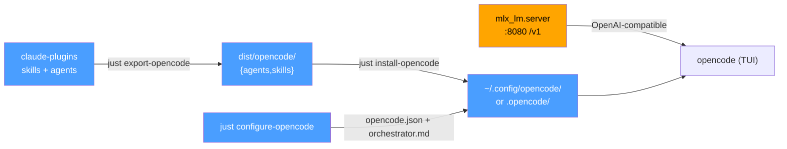

# OpenCode export & local-MLX orchestration

This repo's Claude Code skills and subagents can run inside
[OpenCode](https://opencode.ai) against a **local** model served with MLX. This
doc covers the whole pipeline: convert → install → configure → serve → run.

The conversion engine is [`scripts/export-opencode.sh`](../scripts/export-opencode.sh)
(rulesync, `claudecode → opencode`). The install/configure/serve steps are
justfile recipes in the `opencode` group that wrap
[`scripts/install-opencode.sh`](../scripts/install-opencode.sh) and
[`scripts/configure-opencode.sh`](../scripts/configure-opencode.sh).

## Pipeline overview



`just setup-opencode` runs install + configure in one shot and prints the
serve/run next steps.

## 1. Export

```
just export-opencode
```

Produces `dist/opencode/{agents,skills}/`. What converts:

| Surface | Fidelity |
|---------|----------|
| **Skills** | Near-lossless — `SKILL.md`, `REFERENCE.md`, and `scripts/` travel together. |
| **Subagents** | Structural — rulesync drops `model`, `tools`, and `maxTurns` from the frontmatter (OpenCode's agent schema differs). The prompt body and `description` survive. |
| **Hooks** | `command`-type **PreToolUse / PostToolUse** hooks export via our own generator (`generate-opencode-hook-plugins.py`, not rulesync — see [Hooks](#hooks)). `prompt`/`agent` hooks and SessionStart / PreCompact have no OpenCode equivalent and are skipped with a per-plugin report. |

OpenCode reads **plural** `agents/` and `skills/` directories (singular is
accepted for back-compat); the export already emits plural, so no rename is
needed.

### Skill `name` normalization

OpenCode validates skill frontmatter more strictly than Claude Code: `name` must
match `[a-z0-9-]+` **and** equal the skill's directory name. A handful of source
skills are valid Claude Code but violate this — display-style names (`UnoCSS`,
`Lightning CSS`) and unprefixed invocation names (`refocus` in dir
`project-refocus`, `ground-response` in dir `prompt-engineering-ground-response`).
The export's staging step (`rewrite-skill-name-to-dir.py`) rewrites each skill's
`name` to its directory basename, which is always unique and pattern-clean. This
runs on the disposable staging copy only — **the source tree keeps its house-style
names.** Without it, OpenCode aborts those skills at launch with `Invalid
frontmatter … name` / `Name mismatch`.

### Hooks

Hooks bypass rulesync entirely: rulesync reads the consumer `.claude/settings.json`
surface, passes `${CLAUDE_PLUGIN_ROOT}` through literally, and never copies the
referenced scripts ([dyoshikawa/rulesync#1317](https://github.com/dyoshikawa/rulesync/issues/1317)) —
so its output threw `ENOENT` on every matched tool call. Instead,
[`scripts/generate-opencode-hook-plugins.py`](../scripts/generate-opencode-hook-plugins.py)
(issue [#1605](https://github.com/laurigates/claude-plugins/issues/1605)) projects
each plugin's `hooks.json` directly:

```
dist/opencode/
  plugins/<plugin>-hooks.js            # one OpenCode plugin per hook-bearing plugin
  hook-scripts/<plugin>/hooks/*.sh     # the referenced scripts, copied
```

The generated JS resolves its scripts relative to itself
(`../hook-scripts/<plugin>/`) and exports `CLAUDE_PLUGIN_ROOT` at that root, so
the scripts run unmodified. The two trees must travel together —
`install-opencode.sh` copies both.

| Claude Code | OpenCode | Semantics |
|-------------|----------|-----------|
| `PreToolUse` command hook | `tool.execute.before` | exit 2 or JSON `permissionDecision: "deny"` → **throw** (blocks the call); `"ask"` → `console.warn` + allow (OpenCode has no prompt-from-hook) |
| `PostToolUse` command hook | `tool.execute.after` | exit-2 stderr / JSON `decision: "block"` reason / `additionalContext` appended to the model-visible tool output |
| `prompt` / `agent` hooks | — | skipped: OpenCode has no model-evaluation hook (by design) |
| `SessionStart` / `PreCompact` | — | skipped: no context-injection equivalent |

Matchers translate too: bare tool names (`Bash` → `bash`), path-scoped forms
(`Write(docs/prds/**)` → `write` + glob on `filePath`), and `Skill(name)`
(→ the `skill` tool). Everything that cannot export is reported per plugin on
the export output **and** in the generated file's header comment. A script
that goes missing at runtime **fails open** (`console.error` + allow) rather
than blocking every matched call.

Regression guard: [`scripts/tests/test-export-opencode-hooks.sh`](../scripts/tests/test-export-opencode-hooks.sh)
asserts every referenced script resolves, blocking semantics survive, no
literal `${CLAUDE_PLUGIN_ROOT}` reaches generated code, and prompt hooks stay
skipped.

## 2. Serve the model

OpenCode talks to any OpenAI-compatible `/v1` endpoint. Serve a local model with
[mlx-lm](https://github.com/ml-explore/mlx-lm):

```
uv tool install mlx-lm
just serve-opencode-model
```

`serve-opencode-model` runs `mlx_lm.server --model <model> --port <port>` with
the configured defaults. Override per invocation:

```
just opencode_model=mlx-community/Qwen3-30B-A3B-4bit opencode_port=8080 serve-opencode-model
```

Verify it's up:

```
curl -s localhost:8080/v1/models
```

The response should list your model id. The model id is **your** choice — any id
your local `mlx_lm.server` exposes (an MLX MoE like `Qwen3-30B-A3B`, a 4-bit
community quant, etc.). It is a recipe variable, not a fixed value.

## 3. Provider config

`just configure-opencode` generates this `opencode.json` (real OpenCode schema):

```json
{
  "$schema": "https://opencode.ai/config.json",
  "provider": {
    "mlx-local": {
      "npm": "@ai-sdk/openai-compatible",
      "name": "Local MLX",
      "options": { "baseURL": "http://127.0.0.1:8080/v1" },
      "models": { "<model-id>": { "name": "<model-id>" } }
    }
  },
  "model": "mlx-local/<model-id>",
  "default_agent": "orchestrator",
  "lsp": true,
  "agent": {
    "build": {
      "permission": {
        "bash": {
          "go test *": "allow", "npm test": "allow", "pytest*": "allow",
          "cargo test*": "allow", "just test*": "allow",
          "git status*": "allow", "git diff*": "allow", "git log*": "allow",
          "*": "ask"
        }
      }
    }
  }
}
```

The `agent.build.permission.bash` block is a `{pattern: allow|ask|deny}` map
(OpenCode's real shape — **not** `permissions`/`file_edits`/`{allow:[]}`, see
Gotchas). It lets the built-in `build` agent run test/status commands without a
permission prompt during the orchestrator's fan-out, while everything else still
falls through to `"*": "ask"`. Tune the patterns via the generated config.

`<model-id>` and the port come from the `opencode_model` / `opencode_port`
recipe variables. The generator is **non-destructive**: if `opencode.json`
already exists it writes `opencode.json.opencode-sample` instead and prints a
merge hint, so a hand-tuned config is never clobbered.

## 4. Orchestrator agent

`configure-opencode` also writes `agents/orchestrator.md` — a read-only primary
agent that decomposes a request and fans out to the exported subagents:

```markdown
---
description: Central router that decomposes a request and delegates to specialized subagents concurrently.
mode: primary
model: mlx-local/<model-id>
temperature: 0.1
permission:
  edit: deny
  bash: deny
  webfetch: deny
  write: deny
---

# The Orchestrator
You analyze the request, inspect project topology read-only (read/glob/grep/list),
and dispatch specialized subagents via the `task` tool — issuing multiple `task`
calls in one turn for independent work. You never edit files or run bash directly.
```

Why `permission:` and not `tools:`: OpenCode's agent frontmatter uses a
`permission:` map (`allow` / `ask` / `deny` per built-in capability). The
`tools:` form is a deprecated `name: bool` map, not a YAML list. The orchestrator
denies `edit` / `write` / `bash` / `webfetch` so it can only read and delegate —
the actual file edits and shell work happen inside the subagents it dispatches
with the built-in `task` tool.

OpenCode's built-in tools are: `read, write, edit, glob, grep, list, bash, task,
skill`.

## 5. Install + run

```
just setup-opencode               # global  → ~/.config/opencode
just setup-opencode .opencode     # project → ./.opencode
```

`setup-opencode` = `install-opencode` (copies `agents/` + `skills/` **additively**
— your own agents/skills are preserved) + `configure-opencode`, then prints the
serve + run next steps.

> **Install into ONE scope only.** OpenCode *merges* global
> (`~/.config/opencode`) and project (`./.opencode`) skills, so installing this
> marketplace into both loads every skill twice and OpenCode reports
> `Duplicate tool names detected` at launch. `install-opencode` drops a
> `.claude-plugins-opencode-receipt` marker in each scope it installs into and
> emits `STATUS=WARN` + a `FIX=` remediation line if the complementary scope
> already carries one. Pick global *or* project; to switch, remove the other
> scope's `skills/`, `agents/`, and receipt first.

Then:

```
cd <project>
opencode
```

- Run `/init` once to have OpenCode write an `AGENTS.md` for the project.
- Switch agents with **Tab** or the `/agents` picker — reach `orchestrator` there
  (and it's the `default_agent`, so it's selected on launch).

## 6. Recommended ecosystem plugins

OpenCode has a community plugin ecosystem that can sharpen the orchestrated
local-model workflow. Every plugin below was **verified against npm / GitHub /
opencode.ai/docs** — AI-suggested OpenCode plugin lists have a high fabrication
rate, so names and install mechanisms here are the real ones, not the
brainstormed forms.

### How plugins load

A plugin is a JS/TS module. Two load paths:

- **npm package** listed in the `"plugin": [...]` array of `opencode.json` —
  bare (`opencode-pty`), scoped (`@openspoon/subtask2`), or version-pinned
  (`opencode-vibeguard@0.1.0`). OpenCode auto-installs them with Bun on startup.
- **Local file** under `.opencode/plugins/` (project) or
  `~/.config/opencode/plugins/` (global).

There is **no `github:user/repo` shorthand** and **no central registry** —
discover plugins by searching npm for the `opencode-plugin` keyword.

### Baked-in defaults

`just configure-opencode` writes a small, curated `plugin:` array (overridable
via `OPENCODE_PLUGINS` or `just opencode_plugins="…" configure-opencode`):

| Plugin (npm) | Why it's a default |
|--------------|--------------------|
| `@openspoon/subtask2` | The only orchestration plugin installable via the npm `plugin:` array. Adds flow-control over `/commands` and **verifies a subtask's output against the codebase before merging it back** — directly strengthens the orchestrator's fan-out. |
| `opencode-pty` | Runs background/interactive processes (dev servers, test watchers, REPLs) in a pseudo-terminal and can send input (e.g. answer a `y/n` prompt), so a subagent doesn't hang on the synchronous built-in `bash` tool. |
| `@tarquinen/opencode-dcp` | **Dynamic context pruning** — dedupes repeated tool outputs and exposes a model-invokable `compress` tool, stretching a local model's smaller context window. The GitHub repo name `opencode-dynamic-context-pruning` is the **same package**; never list a second copy. |

All three are npm, no API key required, self-host-friendly.

> **Note on `opencode-skills` / `opencode-gemini-auth`:** these are **not** defaults.
> OpenCode discovers and runs `skills/` natively via its built-in `skill` tool, so
> `opencode-skills` is redundant (and risks a `Duplicate tool names` clash);
> `opencode-gemini-auth` is a Gemini *auth* plugin with no value in a pure-local
> MLX setup unless you also configure a Gemini provider.

### Opt-in npm plugins

Add these to your own `plugin:` array (or `OPENCODE_PLUGINS`) if they fit:

| Plugin (real npm name) | What it does | Caveat |
|------------------------|--------------|--------|
| `@nick-vi/opencode-type-inject` | Injects TS/Svelte type signatures into file reads so the model skips whole source files (token saver). | TypeScript/Svelte only. Note the scoped name — bare `opencode-type-inject` is **not** the install string. |
| `opencode-scheduler` | Schedules `opencode run` jobs on the OS-native scheduler (launchd / systemd timers / Task Scheduler, cron as fallback) for overnight maintenance. | Cross-platform — **not** macOS/launchd-only as sometimes claimed. |
| `opencode-vibeguard` | Redacts secrets/PII to placeholders before context reaches the model, restores locally. | Early `v0.1.0`. Mainly valuable when mixing local + an **external** API; low value for a pure-local setup. Alternative: `opencode-secret-redactor`. |
| `@f97/opencode-morph-fast-apply` / `@morphllm/opencode-morph-plugin` | Morph "fast apply": lazy edit markers (`// ... existing code ...`) for ~10× faster code patching. | **Requires an external Morph API key** — this breaks a fully-self-hosted-via-mlx setup. Opt in only if you accept an external apply service. Bare `opencode-morph-fast-apply` is a GitHub repo name, not the npm install string. |

### Already covered — do not double-install

`@tarquinen/opencode-dcp` (dynamic context pruning) is now a **baked-in default**
(see the defaults table above). The frequently-suggested
`opencode-dynamic-context-pruning` is the **same package** — that's the GitHub
repo name; `@tarquinen/opencode-dcp` is its npm name. Do not add a second copy to
`OPENCODE_PLUGINS` or a hand-tuned `plugin:` array.

### OCX plugins (third-party CLI/registry)

Three real orchestration plugins by `kdcokenny` are distributed via the
third-party **OCX** CLI + registry (`registry.kdco.dev`), **not** the npm
`plugin:` array — so they're a separate, explicitly opt-in path with a
third-party trust dependency. They write into `.opencode/plugin/`.

```
just install-opencode-ocx        # installs worktree + background-agents via OCX
```

| OCX plugin | Recipe installs it? | Notes |
|------------|---------------------|-------|
| `worktree` | ✅ | Per-session git worktrees so parallel agents avoid branch collisions. Complements our `agent-coworker-detection` discipline. |
| `background-agents` | ✅ | Async task delegation; persists sub-agent results to disk so they survive context compaction. |
| `opencode-workspace` | ❌ **excluded by design** | Bundles its own researcher/coder/scribe/reviewer agents + DCP + worktrees (16 components). **Overlaps and competes with the agents + orchestrator we already export** — prefer ours. Documented here for awareness; `install-opencode-ocx` deliberately skips it. |

`install-opencode-ocx` requires the OCX CLI on `PATH` (it does not install OCX
itself); without it the recipe prints a prerequisite hint and exits cleanly.

### Verified-vs-claimed corrections

So the fabrication-prone forms aren't re-adopted:

| Suggested form | Reality |
|----------------|---------|
| `opencode-dynamic-context-pruning` as a *new* install | Same package as the already-installed `@tarquinen/opencode-dcp` — redundant. |
| bare `opencode-type-inject` | Scoped: `@nick-vi/opencode-type-inject`. |
| bare `opencode-morph-fast-apply` | `@f97/opencode-morph-fast-apply` or `@morphllm/opencode-morph-plugin`; **needs a Morph API key**. |
| `opencode-scheduler` = macOS/launchd-only | Cross-platform (launchd/systemd/cron fallback). |
| `background-agents` / `workspace` / `worktree` via npm `plugin:` array | OCX-distributed (`registry.kdco.dev`), not npm; `workspace` overlaps our exported agents. |

## Gotchas — common-but-wrong config

A plausible-looking config that does **not** work in OpenCode. If you're adapting
a brainstorm or an older snippet, check it against this table:

| Looks right | Actually | Use instead |
|-------------|----------|-------------|
| `"providers": { id: { api_base, api_key }}` | No such keys | `"provider": { id: { "npm", "options": { "baseURL" }, "models" }}` |
| `"attention": { enabled }` in `opencode.json` | Lives in `tui.json` | Omit from `opencode.json` |
| `tools:` as a YAML list in agent frontmatter | `tools:` is a deprecated `name: bool` map | `permission:` map (`allow`/`ask`/`deny`) |
| `"permissions": { "file_edits": ..., "bash": { "allow": [...], "default": ... }}` | No such keys; this is a brainstorm shape | `"permission": { "edit": ..., "bash": { "go test *": "allow", "*": "ask" }}` (singular key, `edit` not `file_edits`, bash is a pattern→verdict map) |
| Config-level `"agents": { ... }` (plural) | The opencode.json key is singular | `"agent": { "build": { ... }}` (directories are plural `agents/`; the JSON key is singular `agent`) |
| `get_symbols_overview` builtin tool | Not a builtin | Builtins: `read, write, edit, glob, grep, list, bash, task, skill` |
| `Leader+Down` / arrow keys to switch subagents | Unverified keybinds | **Tab** or `/agents` |
| Hardcoding *any* model id as if it's universal | The id must match what *your* `mlx_lm.server` exposes | Set your own MLX model id via `opencode_model` (verify with `curl localhost:8080/v1/models`) |

## Limitations

- **Agent orchestration metadata is dropped on export** — `model`, `tools`, and
  `maxTurns` don't survive rulesync's `claudecode → opencode` conversion. The
  generated `orchestrator.md` re-establishes a primary agent by hand; exported
  subagents keep only their prompt + description.
- **Hook export is partial by platform design** — `prompt`/`agent` hooks and
  SessionStart / PreCompact command hooks have no OpenCode equivalent and are
  skipped with a per-plugin report; PreToolUse `permissionDecision: "ask"`
  degrades to a non-blocking warning (see [Hooks](#hooks)).
- **Local-model capability** — a local MLX model is smaller than a frontier
  model; complex orchestration may need a larger quant or a stronger model id.

## Related

- [`scripts/export-opencode.sh`](../scripts/export-opencode.sh) — conversion engine
- [`scripts/generate-opencode-hook-plugins.py`](../scripts/generate-opencode-hook-plugins.py) — hooks.json → OpenCode JS plugin generator
- [`scripts/tests/test-export-opencode-hooks.sh`](../scripts/tests/test-export-opencode-hooks.sh) — hooks-export regression guard
- [`scripts/install-opencode.sh`](../scripts/install-opencode.sh) — additive installer
- [`scripts/configure-opencode.sh`](../scripts/configure-opencode.sh) — config + orchestrator generator
- [`scripts/tests/test-configure-opencode.sh`](../scripts/tests/test-configure-opencode.sh) — schema regression guard
- [OpenCode docs](https://opencode.ai/docs) — upstream source of truth for the schema
