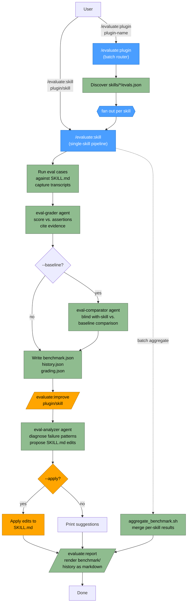

# Evaluate Plugin Flow

## Legend

| Node style | Meaning |
|------------|---------|
| Blue | Router / orchestrator skill (`/evaluate:skill`, `/evaluate:plugin`) |
| Green | Read-only run, grading, analysis, or reporting step |
| Orange | Mutating step (applies edits to `SKILL.md`) |

## Stage → Skill/Agent mapping

| Stage | Skill | Agent |
|-------|-------|-------|
| Evaluate | `/evaluate:skill` (`evaluate-skill/`) | `eval-grader` (grade), `eval-comparator` (blind with-skill vs. baseline) |
| Improve | `/evaluate:improve` (`evaluate-improve/`) | `eval-analyzer` (diagnose + propose edits) |
| Report | `/evaluate:report` (`evaluate-report/`) | — |
| Batch | `/evaluate:plugin` (`evaluate-plugin-batch/`) | fans out to `/evaluate:skill` per skill, then `aggregate_benchmark.sh` merges results into a single report |
