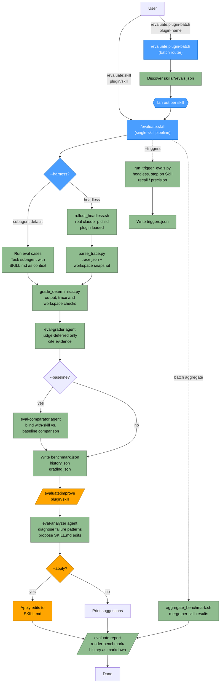

# Evaluate Plugin Flow

```mermaid
flowchart TD
    U[User] -->|/evaluate:skill<br/>plugin/skill| ES["/evaluate:skill<br/>(single-skill pipeline)"]
    U -->|/evaluate:plugin-batch<br/>plugin-name| EB["/evaluate:plugin-batch<br/>(batch router)"]

    %% Single-skill pipeline
    ES --> HARN{--harness?}
    HARN -->|subagent default| RUN[Run eval cases<br/>Task subagent with<br/>SKILL.md as context]
    HARN -->|headless| HL[rollout_headless.sh<br/>real claude -p child<br/>plugin loaded]
    HL --> TRACE[parse_trace.py<br/>trace.json +<br/>workspace snapshot]
    RUN --> DET
    TRACE --> DET[grade_deterministic.py<br/>output, trace and<br/>workspace checks]
    DET --> GRADE[eval-grader agent<br/>judge-deferred only<br/>cite evidence]
    ES -.->|"--triggers"| TRG[run_trigger_evals.py<br/>headless, stop on Skill<br/>recall / precision]
    TRG --> TJ[Write triggers.json]
    GRADE --> CMP{--baseline?}
    CMP -->|yes| COMP[eval-comparator agent<br/>blind with-skill vs.<br/>baseline comparison]
    CMP -->|no| BENCH
    COMP --> BENCH[Write benchmark.json<br/>history.json<br/>grading.json]

    BENCH --> IMP[/evaluate:improve<br/>plugin/skill/]
    IMP --> ANA[eval-analyzer agent<br/>diagnose failure patterns<br/>propose SKILL.md edits]
    ANA --> APPLY{--apply?}
    APPLY -->|yes| EDIT[Apply edits to<br/>SKILL.md]
    APPLY -->|no| SUGG[Print suggestions]
    EDIT --> RPT
    SUGG --> RPT

    RPT[/evaluate:report<br/>render benchmark/<br/>history as markdown/]
    RPT --> DONE[Done]

    %% Batch side-branch
    EB --> DISC[Discover skills/*/evals.json]
    DISC --> FAN{{fan out per skill}}
    FAN --> ES
    ES -.batch aggregate.-> AGG[aggregate_benchmark.sh<br/>merge per-skill results]
    AGG --> RPT

    classDef router fill:#4a9eff,stroke:#1a6ecc,color:#fff
    classDef check fill:#8fbc8f,stroke:#556b55,color:#000
    classDef fix fill:#ffa500,stroke:#b37400,color:#000

    class ES,EB,FAN router
    class RUN,GRADE,COMP,BENCH,ANA,RPT,AGG,DISC,HL,TRACE,DET,TRG,TJ check
    class HARN router
    class EDIT,IMP,APPLY fix
```

## Legend

| Node style | Meaning |
|------------|---------|
| Blue | Router / orchestrator skill (`/evaluate:skill`, `/evaluate:plugin-batch`), or a routing decision (`--harness`) |
| Green | Read-only run, grading, analysis, or reporting step |
| Orange | Mutating step (applies edits to `SKILL.md`) |

## Stage → Skill/Agent mapping

| Stage | Skill | Agent |
|-------|-------|-------|
| Evaluate | `/evaluate:skill` (`evaluate-skill/`) | `eval-grader` (grade), `eval-comparator` (blind with-skill vs. baseline) |
| Headless rollout (opt-in `--harness headless`) | `/evaluate:skill`, `/evaluate:matrix` via `scripts/rollout_headless.sh` + `parse_trace.py` | one thin runner per cell; the `claude -p` child does the task |
| Trigger evals (`--triggers`) | `/evaluate:skill` via `scripts/run_trigger_evals.py` | — (headless children only) |
| Improve | `/evaluate:improve` (`evaluate-improve/`) | `eval-analyzer` (diagnose + propose edits) |
| Report | `/evaluate:report` (`evaluate-report/`) | — |
| Batch | `/evaluate:plugin-batch` (`evaluate-plugin-batch/`) | fans out to `/evaluate:skill` per skill (forwarding `--harness`), then `aggregate_benchmark.sh` merges results into a single report |
