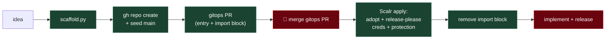

# foundryvtt-module

Take a FoundryVTT **module idea** and drive it from empty to release-ready,
collapsing the manual repo-creation + gitops wiring into one orchestrated pass
with a single human approval gate.

This is the orchestrator around the `foundryvtt-module-scaffold` skill (which
only generates the local repo). Use `foundryvtt-module-scaffold` alone if you
just want the files; use **this** when you want the GitHub repo created, pushed,
and adopted into gitops too.

## When to Use This Skill

| Use this skill when... | Use the alternative when... |
|---|---|
| The user gives an idea and wants the whole pipeline stood up — repo created, seeded, and gitops-adopted | You only want the local files → `foundryvtt-module-scaffold` |
| Spinning up a new FoundryVTT module end to end | Adding a feature to an *existing* module → edit that repo directly |

Do **not** use it to add a feature to an existing module, or to publish a release
(release-please + the release workflow automate that once the repo exists).

## The shape it automates



Everything left of the gate is one orchestrated pass. There is **no scaffold
PR** — the seed goes straight to `main` (the repo is unprotected until adoption).
The single gate (merging the gitops PR) is intentionally human — it triggers an
infra `apply` on shared state. Never merge it on the user's behalf.

## Preconditions

- Run from the FoundryVTT workspace (`repos/laurigates/foundryvtt-dev/`) so the
  new repo lands as a sibling of `foundryvtt-mcp` / `foundryvtt-mediasoup-webrtc`.
- `gh auth status` is a **personal** account that can create repos. The gitops
  GitHub App *cannot* create repos on user accounts — that is why the repo is
  created out-of-band here and then imported into Terraform state.
- The gitops repo is clean (no uncommitted `repositories.tf` / `main.tf`
  changes) so the orchestrator's gitops PR is isolated.

## Phase 0 — Derive and confirm the spec

From the idea, derive and **show the user** before creating anything external:

| Field | How to derive | Example |
|-------|---------------|---------|
| `--name` | `foundryvtt-<kebab>` (the GitHub repo). | `foundryvtt-initiative-tweaks` |
| `--id` | Foundry module id; default = `--name` minus `foundryvtt-`. | `initiative-tweaks` |
| `--display` | Title-case. | `Initiative Tweaks` |
| `--desc` | One line, manifest-facing. | `Small quality-of-life tweaks to the combat initiative tracker.` |
| `--variant` | `app` for a UI window; `libwrapper` to patch a core method; else `basic`. | `basic` |
| `--fvtt-verified` | The major Foundry version the harness pins. | `13` |
| topics | `["foundryvtt", "module", …]` + facet tags. | `…,"combat","initiative"` |

Confirm the **name, id, and variant** with the user — these are hard to change
after the repo exists.

## Phase 1 — Preflight (fail fast if the name is taken)

```sh
test ! -e foundryvtt-initiative-tweaks && echo "local: free" || echo "local: EXISTS"
```

```sh
grep -q '"foundryvtt-initiative-tweaks"' ../gitops/repositories.tf && echo "gitops: EXISTS" || echo "gitops: free"
```

```sh
gh repo view laurigates/foundryvtt-initiative-tweaks >/dev/null 2>&1 && echo "github: EXISTS" || echo "github: free"
```

All three must report free. Stop and surface any collision. (The `../gitops`
path assumes the foundryvtt-dev workspace layout; adjust if the gitops clone is
elsewhere.)

## Phase 2 — Scaffold + local green check

```sh
python3 ${CLAUDE_SKILL_DIR}/../foundryvtt-module-scaffold/scaffold.py --name foundryvtt-initiative-tweaks --display "Initiative Tweaks" --desc "Small quality-of-life tweaks to the combat initiative tracker." --variant basic
```

Then bring the module to green locally:

```sh
cd foundryvtt-initiative-tweaks
```

```sh
git init -b main
```

```sh
bun install
```

```sh
just check
```

`just check` (typecheck + build + lint + test) must pass before anything is
pushed. `bun install` writes `bun.lock` — it must be in the seed commit (CI uses
`--frozen-lockfile`). If `just check` fails, fix locally and re-run — do not
create the remote repo on a red module.

## Phase 3 — Create the GitHub repo and seed `main`

Seed `main` **directly** as the first commit — no scaffold branch, no PR. The
repo has no branch protection yet (gitops adds it on adoption in Phase 5), so
this is allowed, and it avoids the missing-`main`/rename juggling a feature-branch
first push would cause. Implementation work afterward goes through feature-branch
PRs as normal.

```sh
git add -A
```

```sh
git commit -m "feat: scaffold foundryvtt-initiative-tweaks (basic module)"
```

```sh
gh repo create laurigates/foundryvtt-initiative-tweaks --public --source . --remote origin --push
```

> **Branch-protection hook note (expect this):** in a Claude Code session the
> `branch-protection` hook **will** block the agent from `git add`/`commit` on
> `main` for a brand-new, not-yet-protected repo (a false positive). Hand the
> whole seed to the user as one paste-safe line to run with the `! ` prefix:
>
> ```
> cd <repo> && git add -A && git commit -m "feat: scaffold <name> (<variant> module)" && gh repo create laurigates/<name> --public --source . --remote origin --push
> ```
>
> Do **not** work around it by seeding a feature branch — that reintroduces the
> missing-`main`/rename juggling this phase exists to avoid.

The `--push` makes the seeded `main` the default branch.

## Phase 4 — Open the gitops PR (entry + transient import block)

Two edits in the `gitops/` repo, on a dedicated branch.

**`gitops/repositories.tf`** — add to the active repositories `locals` block,
next to the other `foundryvtt-*` entries (mirror `foundryvtt-mcp`):

```hcl
    "foundryvtt-initiative-tweaks" = {
      description    = "Small quality-of-life tweaks to the combat initiative tracker"
      visibility     = "public"
      release_please = true
      topics         = ["foundryvtt", "module", "combat", "initiative"]
    }
```

**`gitops/main.tf`** — add a transient `import` block alongside the existing
ones at the top of the file:

```hcl
import {
  to = github_repository.this["foundryvtt-initiative-tweaks"]
  id = "foundryvtt-initiative-tweaks"
}
```

FoundryVTT modules distribute via GitHub releases — there is **no registry flag**
(unlike comfy packs' `comfy_registry`). The only adoption flag is
`release_please = true`, which makes gitops push the release-please App
credentials on apply.

Validate, branch, commit, push, open the PR (run inside `gitops/`):

```sh
just check
```

```sh
git -C ../gitops switch -c feat/adopt-foundryvtt-initiative-tweaks
```

```sh
git -C ../gitops add repositories.tf main.tf
```

```sh
git -C ../gitops commit -m "feat: adopt foundryvtt-initiative-tweaks"
```

```sh
git -C ../gitops push -u origin feat/adopt-foundryvtt-initiative-tweaks
```

```sh
gh pr create -R laurigates/gitops -a laurigates -l chore -l opentofu --title "feat: adopt foundryvtt-initiative-tweaks" --body-file /tmp/gitops-pr-body.md
```

Write a short body (to `/tmp/gitops-pr-body.md`) rather than `--fill` — it's an
infra PR that triggers an apply, so spell out what merge does: imports the repo,
pushes the release-please App credentials, applies the branch-protection ruleset,
and that a follow-up PR removes the import block. Use labels `chore` + `opentofu`
(check `gh label list -R laurigates/gitops` if unsure). Set metadata per
`github-metadata-hygiene` (assignee `laurigates`; skip self-reviewer — the author
is the running user). Scalr posts a `plan` check; the expected plan **imports**
the repo and **creates** the release-please var/secret + branch-protection
ruleset.

## Phase 5 — Human gate, then finish

Hand the user the new repo URL and the **gitops PR** URL. **The user merges the
gitops PR** — that is the Scalr `apply` trigger on shared infra state. Do not
merge it for them.

After the user confirms the Scalr apply landed, verify the release-please
credentials and remove the now-dead import block:

```sh
gh api repos/laurigates/foundryvtt-initiative-tweaks/actions/variables/RELEASE_PLEASE_APP_ID --jq .name
```

The variable lookup should return its name. Then open the import-block-removal
follow-up PR:

```sh
git -C ../gitops switch -c chore/remove-foundryvtt-initiative-tweaks-import
```

Remove the `import { … "foundryvtt-initiative-tweaks" … }` block from `main.tf`,
then:

```sh
git -C ../gitops commit -am "chore: remove one-time import block for foundryvtt-initiative-tweaks"
```

```sh
git -C ../gitops push -u origin chore/remove-foundryvtt-initiative-tweaks-import
```

```sh
gh pr create -R laurigates/gitops -a laurigates -l chore --fill --title "chore: remove foundryvtt-initiative-tweaks import block"
```

## Phase 6 — Hand back to implementation

The pipeline is now live: conventional-commit feature PRs → merge →
release-please PR → merge → tag → the release workflow builds, zips `dist/`, and
attaches `<id>.zip` + `module.json` to the GitHub release (the manifest URL).
Tell the user what's left:

- Implement the module logic (`basic`: `src/module.ts` + `src/settings.ts`;
  `app`: `src/app.ts` + `templates/app.hbs`; `libwrapper`: replace the
  `Token._draw` example in `src/patches.ts`).
- Test against the local `foundryvtt-harness` (`bun run dev`, or build + symlink
  `dist/` into the harness's `Data/modules/<id>`). Keep `module.json`
  `compatibility` in sync with the harness-pinned Foundry version.
- First merged `feat:`/`fix:` commits drive the first release-please PR.

Log durable follow-ups to the user's FoundryVTT taskwarrior project per
`taskwarrior-cross-session`.

## Failure modes & guards

| Symptom | Cause | Fix |
|---------|-------|-----|
| release-please job fails on empty `app-id` | release-please credentials not yet applied | Confirm the Scalr apply landed; `gh api … variables/RELEASE_PLEASE_APP_ID` returns a name; re-run via `workflow_dispatch` |
| `403 Resource not accessible by integration` on repo create | Tried to create via the gitops App, not a personal token | Create with personal `gh auth`; the App only adopts via import |
| Scalr plan shows a *create* (not *import*) for the repo | Import block missing or `id` wrong | The `id` is the bare repo name, not `owner/name`; add/fix the import block |
| `just check` red in gitops | `tofu fmt`/`validate` failure | `just format` then re-check before pushing |
| Module fails to load in Foundry | `esmodules` path ≠ Vite output, or `id` ≠ folder | The scaffold pins these; confirm `dist/<id>.mjs` exists and the install folder is `<id>` |

## Notes

- The orchestrator never runs `tofu apply` — all applies go through Scalr on
  merge (see `gitops/CLAUDE.md`). Local gitops work is `plan`/`validate` only.
- Playwright integration tests against the harness and a Quench in-Foundry suite
  are not scaffolded; add them later if the module warrants them.
