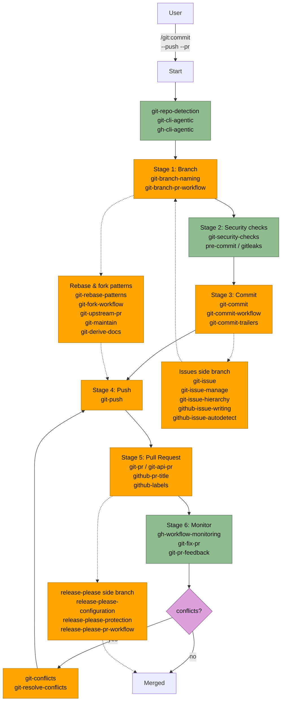

# Git Plugin Flow

## Legend

| Node style | Meaning |
|------------|---------|
| Green | Read-only diagnostic / detection (repo detection, security scan, workflow monitoring) |
| Orange | Writes state (branch create, commit, push, PR, release-please, issue ops) |
| Purple | Decision / interactive prompt |
| Dashed edge | Side branch — invoked situationally, not every run |

## Stage → Skill mapping

| Stage | Skills |
|-------|--------|
| Detect | `git-repo-detection`, `git-cli-agentic`, `gh-cli-agentic` |
| Branch | `git-branch-naming`, `git-branch-pr-workflow` |
| Security | `git-security-checks` |
| Commit | `git-commit`, `git-commit-workflow`, `git-commit-trailers` |
| Push | `git-push` |
| Pull Request | `git-pr`, `git-api-pr`, `github-pr-title`, `github-labels` |
| Monitor | `gh-workflow-monitoring`, `git-fix-pr`, `git-pr-feedback` |
| Conflicts | `git-conflicts`, `git-resolve-conflicts` |
| Issues (side) | `git-issue`, `git-issue-manage`, `git-issue-hierarchy`, `github-issue-writing`, `github-issue-autodetect` |
| Release-please (side) | `release-please-configuration`, `release-please-protection`, `release-please-pr-workflow` |
| Rebase / fork (side) | `git-rebase-patterns`, `git-fork-workflow`, `git-upstream-pr`, `git-maintain`, `git-derive-docs` |
