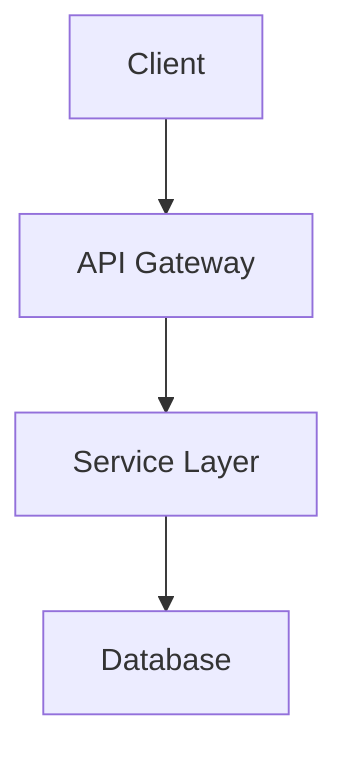

## configure-readme

## Execution

Execute this README configuration workflow:


### Step 1: Detect project metadata

Read project metadata from the detected package files:

1. **package.json** (JavaScript/TypeScript): Extract name, description, version, license, repository, keywords
2. **pyproject.toml** (Python): Extract project name, description, version, license, keywords, URLs
3. **Cargo.toml** (Rust): Extract package name, description, version, license, repository, keywords
4. **go.mod** (Go): Extract module path for owner/repo

**Fallback detection** when no package file matches:
- Project name: directory name
- Description: first line of existing README or ask user
- Repository: git remote URL
- License: LICENSE file content

For detailed package file format examples, see .


### Step 2: Analyze current README state

Check existing README.md for these sections:

- [ ] Logo/icon present (centered image at top)
- [ ] Project title (h1)
- [ ] Description/tagline
- [ ] Badges row (license, version, CI status, coverage)
- [ ] Features section
- [ ] Tech Stack section
- [ ] Prerequisites section
- [ ] Installation instructions
- [ ] Usage examples
- [ ] Project structure
- [ ] Contributing guidelines
- [ ] License section

Discover logo/icon assets in common locations:
- `assets/logo.png`, `assets/icon.png`, `assets/logo.svg`
- `public/logo.png`, `public/icon.svg`
- `images/logo.png`, `docs/assets/logo.png`
- `.github/logo.png`, `.github/images/logo.png`


### Step 3: Generate compliance report

Print a section-by-section compliance report showing PASS/MISSING/PARTIAL status for each README section. Include content quality checks (code examples, command correctness, link validity).

If `--check-only` is set, stop here.

For the compliance report format, see .


### Step 4: Apply configuration (if --fix or user confirms)

Generate README.md following the standard template structure:

1. Centered logo section (if assets exist and `--no-logo` not set)
2. Project title and tagline
3. Badge row with shields.io URLs
4. Features section with key highlights
5. Tech Stack table
6. Getting Started (prerequisites, installation, usage)
7. Project Structure
8. Development commands
9. Contributing section
10. License section

For the full README template and badge URL patterns, see .


### Step 5: Handle logo and assets

If no logo exists but user wants one:

1. Check for existing assets in standard locations
2. Suggest creating a simple text-based placeholder or using emoji heading
3. Create assets directory if needed: `mkdir -p assets`
4. Suggest tools: Shields.io for custom badges, Simple Icons for technology icons


### Step 6: Detect project commands

Auto-detect project commands based on package manager/build tool:

| Package Manager | Install | Run | Test | Build |
|----------------|---------|-----|------|-------|
| npm/bun (package.json) | Read `scripts` from package.json | `npm run dev` | `npm test` | `npm run build` |
| uv/poetry (pyproject.toml) | `uv sync` / `poetry install` | `uv run python -m pkg` | `uv run pytest` | - |
| cargo (Cargo.toml) | `cargo build` | `cargo run` | `cargo test` | `cargo build --release` |
| go (go.mod) | `go build` | `go run .` | `go test ./...` | `go build` |


### Step 7: Generate project structure

Run `tree -L 2 -I 'node_modules|target|__pycache__|.git|dist|build' --dirsfirst` to generate accurate project structure. Skip common generated directories (node_modules, vendor, target, dist, build, __pycache__, .pytest_cache, .git, .venv, venv).


### Step 8: Update standards tracking

Update `.project-standards.yaml`:

```yaml
components:
  readme: "2025.1"
  readme_style: "[minimal|standard|detailed]"
  readme_has_logo: true|false
  readme_badges: ["license", "stars", "ci", "version"]
```


### Step 9: Validate generated README

After generating README, validate:

1. Check for markdown syntax errors
2. Verify all links are accessible (warn only)
3. Ensure shields.io URLs are correctly formatted
4. Verify logo/image paths exist


### Step 10: Report configuration results

Print a summary of changes made, the README location, and recommended next steps (customize feature descriptions, add logo, run other configure commands).

For the results report format, see .

When `--style detailed` is specified, also include architecture section with mermaid diagram, API reference link, and changelog link. For detailed style templates, see .


## Output

Provide:
1. Compliance report with section-by-section status
2. Generated or updated README.md content
3. List of detected project metadata
4. Suggestions for improvement (logo, more features, etc.)


# configure-readme Reference


## Package File Format Examples


### package.json (JavaScript/TypeScript)

```javascript
{
  "name": "project-name",
  "description": "Project description",
  "version": "1.0.0",
  "license": "MIT",
  "repository": { "url": "github:owner/repo" },
  "keywords": ["keyword1", "keyword2"]
}
```


### pyproject.toml (Python)

```toml
[project]
name = "project-name"
description = "Project description"
version = "1.0.0"
license = "MIT"
keywords = ["keyword1", "keyword2"]

[project.urls]
Repository = "https://github.com/owner/repo"
```


### Cargo.toml (Rust)

```toml
[package]
name = "project-name"
description = "Project description"
version = "1.0.0"
license = "MIT"
repository = "https://github.com/owner/repo"
keywords = ["keyword1", "keyword2"]
```


### go.mod (Go)

```
module github.com/owner/repo
```


## Compliance Report Format

```
README.md Compliance Report
===========================
Project: [name]
Style Level: [minimal|standard|detailed]

Structure:
  Logo/Icon              [PASS | MISSING | N/A (no assets)]
  Title                  [PASS | MISSING]
  Description            [PASS | MISSING | TOO SHORT]
  Badges                 [PASS | PARTIAL | MISSING]
  Features               [PASS | MISSING]
  Tech Stack             [PASS | MISSING]
  Getting Started        [PASS | INCOMPLETE | MISSING]
  Project Structure      [PASS | MISSING | N/A (small project)]
  License                [PASS | MISSING]

Content Quality:
  Has code examples      [YES | NO]
  Commands are correct   [YES | OUTDATED]
  Links are valid        [YES | BROKEN LINKS]

Overall: [X issues found]
```


## README Template (Standard Style)

```markdown
<div align="center">


# PROJECT_NAME

**TAGLINE_DESCRIPTION**

[](LICENSE)
[](https://github.com/OWNER/REPO/stargazers)
[](https://github.com/OWNER/REPO/actions)
[]()

</div>


## Features

- **Feature 1** - Description of the first key feature
- **Feature 2** - Description of the second key feature
- **Feature 3** - Description of the third key feature
- **Feature 4** - Description of the fourth key feature


## Tech Stack

| Category | Technology |
|----------|------------|
| Runtime | Node.js / Bun / Python / Rust |
| Framework | Express / Fastify / FastAPI / Axum |
| Database | PostgreSQL / SQLite / MongoDB |
| Testing | Vitest / pytest / cargo-nextest |


## Getting Started


### Prerequisites

- [Prerequisite 1](link) >= version
- [Prerequisite 2](link) >= version


### Installation

```bash

# Clone the repository
git clone https://github.com/OWNER/REPO.git
cd REPO


# Install dependencies
INSTALL_COMMAND


# Run the application
RUN_COMMAND
```


### Usage

```bash

# Example command
EXAMPLE_COMMAND
```


## Project Structure

```
PROJECT_NAME/
├── src/               # Source code
│   ├── components/    # UI components (if applicable)
│   └── services/      # Business logic
├── tests/             # Test files
├── docs/              # Documentation
└── README.md
```


## Development

```bash

# Run tests
TEST_COMMAND


# Run linter
LINT_COMMAND


# Build for production
BUILD_COMMAND
```


## Contributing

Contributions are welcome! Please read our [Contributing Guidelines](CONTRIBUTING.md) before submitting a PR.


## License

This project is licensed under the [LICENSE_TYPE](LICENSE) license.
```


## Badge URL Patterns


### Standard Shields.io Badges

| Badge Type | URL Pattern |
|------------|-------------|
| License | `https://img.shields.io/github/license/OWNER/REPO` |
| Stars | `https://img.shields.io/github/stars/OWNER/REPO` |
| Forks | `https://img.shields.io/github/forks/OWNER/REPO` |
| Issues | `https://img.shields.io/github/issues/OWNER/REPO` |
| CI Status | `https://img.shields.io/github/actions/workflow/status/OWNER/REPO/WORKFLOW.yml` |
| Version | `https://img.shields.io/github/v/release/OWNER/REPO` |
| npm | `https://img.shields.io/npm/v/PACKAGE` |
| PyPI | `https://img.shields.io/pypi/v/PACKAGE` |
| Crates.io | `https://img.shields.io/crates/v/PACKAGE` |


### Runtime/Tech Badges

| Technology | Badge URL |
|------------|-----------|
| Bun | `https://img.shields.io/badge/runtime-Bun-f9f1e1` |
| Node.js | `https://img.shields.io/badge/node-%3E%3D20-brightgreen` |
| TypeScript | `https://img.shields.io/badge/TypeScript-5.x-blue` |
| Python | `https://img.shields.io/badge/python-3.12-blue` |
| Rust | `https://img.shields.io/badge/rust-1.75+-orange` |
| Go | `https://img.shields.io/badge/go-1.22-00ADD8` |


## Placeholder Logo

When no logo exists:

```markdown
<div align="center">
<h1>PROJECT_NAME</h1>
</div>
```

Tools for creating logos:
- [Shields.io](https://shields.io) for custom badges
- [Simple Icons](https://simpleicons.org) for technology icons
- AI image generators for custom logos


## Results Report Format

```
README.md Compliance Report (After Configuration)
=================================================
Project: [name]
Style Level: [minimal|standard|detailed]

Changes Made:
  Added centered logo section
  Generated badge row (license, stars, CI)
  Created Features section with 4 highlights
  Added Tech Stack table
  Generated Getting Started with correct commands
  Created Project Structure from actual layout
  Added License section

README Location: ./README.md
Preview: Open in VS Code or view on GitHub

Next Steps:
  - Review and customize feature descriptions
  - Add a logo image to assets/ (optional)
  - Run /configure:github-pages to publish documentation
  - Consider adding CONTRIBUTING.md and CHANGELOG.md
```


## Detailed Style Additions

When `--style detailed` is specified, also include:


### Architecture Section

```markdown

## Architecture


```


### API Reference Link

```markdown

## API Reference

See the [API Documentation](docs/api.md) for detailed endpoint information.
```


### Changelog Link

```markdown

## Changelog

See [CHANGELOG.md](CHANGELOG.md) for version history.
```

---

## blueprint-claude-md

Generate or update the project's CLAUDE.md file based on blueprint artifacts, PRDs, and project structure.
## CLAUDE.md vs Auto Memory

Claude Code has two complementary systems for project context. CLAUDE.md should contain **team-shared instructions** — not patterns Claude learns on its own.

| Belongs in CLAUDE.md | Belongs in Auto Memory (managed by Claude) |
|----------------------|---------------------------------------------|
| Team coding standards | Debugging insights and workarounds |
| Build/test/lint commands | Personal workflow preferences |
| Architecture decisions | Project-specific patterns learned over time |
| Required conventions | File relationships and navigation shortcuts |
| CI/CD workflows | Common mistakes and how to fix them |

Auto memory lives at `~/.claude/projects/<project>/memory/` and is managed automatically. Do not duplicate auto memory concerns into CLAUDE.md.


## Memory Hierarchy (precedence low → high)

1. **User-level rules**: `~/.claude/rules/` — personal rules across all projects
2. **CLAUDE.md (project)**: Team-shared project instructions (checked into git)
3. **CLAUDE.local.md**: Personal project-specific preferences (gitignored)
4. **.claude/rules/**: Modular, path-specific rules
5. **Managed policy**: Organization-wide instructions (enterprise, system paths)
6. **Auto memory**: Claude's own notes (`~/.claude/projects/<project>/memory/`)


## @import Syntax

CLAUDE.md files support importing other markdown files to stay lean:

```markdown

# Project: MyApp

@docs/architecture.md
@docs/conventions.md
@.claude/rules/testing.md
```

- Paths are relative to the file containing the import
- Recursive imports supported (max depth 5)
- Imports are not evaluated inside code spans or code blocks
- First-time external imports trigger an approval dialog

Use `@import` to reference existing documentation rather than duplicating content into CLAUDE.md.

**Steps**:

1. **Check current state**:
   - Look for existing `CLAUDE.md` in project root
   - Look for existing `CLAUDE.local.md` (personal preferences, gitignored)
   - Read `docs/blueprint/manifest.json` for configuration
   - Check for `~/.claude/rules/` (user-level rules)
   - Determine `claude_md_mode` (single, modular, or both)

2. **Determine action** (use report to orchestrator):
   ```
   {If CLAUDE.md exists:}
   question: "CLAUDE.md already exists. What would you like to do?"
   options:
     - "Update with latest project info" → merge updates
     - "Regenerate completely" → overwrite (backup first)
     - "Add missing sections only" → append new content
     - "Add @imports for existing docs" → replace inline content with imports
     - "Convert to modular rules" → split into .claude/rules/
     - "Create CLAUDE.local.md" → personal preferences (gitignored)
     - "View current structure" → analyze and display

   {If CLAUDE.md doesn't exist:}
   question: "No CLAUDE.md found. How would you like to create it?"
   options:
     - "Generate from project analysis" → auto-generate
     - "Generate from PRDs" → use blueprint PRDs
     - "Generate with @imports (lean)" → auto-generate using imports for existing docs
     - "Start with template" → use starter template
     - "Use modular rules instead" → skip CLAUDE.md, use rules/
   ```

3. **Gather project context**:
   - **Project structure**: Detect language, framework, build tools
   - **PRDs**: Read `docs/prds/*.md` for requirements
   - **Work overview**: Current phase and progress
   - **Existing rules**: Content from `.claude/rules/` if present
   - **Git history**: Recent patterns and conventions
   - **Dependencies**: Package managers, key libraries

4. **Generate CLAUDE.md sections**:

   **Standard sections** (focused on team-shared instructions):
   ```markdown
   # Project: {name}

   ## Overview
   {Brief project description from PRDs or detection}

   ## Tech Stack
   - Language: {detected}
   - Framework: {detected}
   - Build: {detected}
   - Test: {detected}

   ## Development Workflow

   ### Getting Started
   {Setup commands}

   ### Running Tests
   {Test commands}

   ### Building
   {Build commands}

   ## Architecture
   {Key architectural decisions from PRDs — or use @import:}
   @docs/prds/architecture-prd.md

   ## Conventions

   ### Code Style
   {Detected or from PRDs}

   ### Commit Messages
   {Conventional commits if detected}

   ### Testing Requirements
   {From PRDs or rules}

   ## See Also
   {If modular rules enabled:}
   - `.claude/rules/` - Detailed rules by domain
   - `docs/prds/` - Product requirements
   ```

   **Sections to omit** (auto memory handles these automatically):
   - "Current Focus" — Claude tracks this in auto memory
   - "Key Files" — Claude learns file relationships automatically
   - Debugging tips — Claude records these in auto memory topic files

5. **If modular rules mode = "both"**:
   - Keep CLAUDE.md as high-level overview
   - Reference `.claude/rules/` for details:
     ```markdown
     ## Detailed Rules
     See `.claude/rules/` for domain-specific guidelines:
     - `development.md` - Development workflow
     - `testing.md` - Testing requirements
     - `frontend/` - Frontend-specific rules
     - `backend/` - Backend-specific rules
     ```

6. **If modular rules mode = "modular"**:
   - Create minimal CLAUDE.md with `@import` references
   - Move detailed content to `.claude/rules/`
   - Example lean CLAUDE.md:
     ```markdown
     # Project: {name}

     ## Overview
     {One-paragraph description}

     @docs/prds/main.md

     ## Development
     {Build, test, lint commands}

     ## Rules
     See `.claude/rules/` for detailed guidelines.
     ```

6b. **If "Create CLAUDE.local.md" selected**:
   - Create `CLAUDE.local.md` in project root for personal preferences
   - Add `CLAUDE.local.md` to `.gitignore` if not already present
   - Template:
     ```markdown
     # Personal Preferences

     ## My Environment
     - IDE: {detected or ask}
     - Terminal: {detected or ask}

     ## My Workflow Preferences
     - {Personal conventions not shared with team}
     ```

6c. **If "Add @imports" selected**:
   - Scan existing CLAUDE.md for sections with content that exists in other files
   - Replace duplicated content with `@path/to/source.md` imports
   - Preserve CLAUDE.md-only content inline
   - Show diff of changes before applying

7. **Smart update** (for existing CLAUDE.md):
   - Parse existing sections
   - Identify outdated content (compare with PRDs, structure)
   - Offer section-by-section updates:
     ```
     question: "Found outdated sections. Which would you like to update?"
     options: [list of sections]
     allowMultiSelect: true
     ```

8. **Sync with modular rules**:
   - If rules exist in `.claude/rules/`
   - Detect duplicated content
   - Offer to deduplicate:
     ```
     question: "Found duplicate content between CLAUDE.md and rules/. How to resolve?"
     options:
       - "Keep in CLAUDE.md, remove from rules"
       - "Keep in rules, reference from CLAUDE.md"
       - "Keep both (may cause confusion)"
     ```

9. **Update manifest**:
   - Record CLAUDE.md generation/update
   - Track which PRDs contributed
   - Update timestamp

10. **Update task registry**:

    Update the task registry entry in `docs/blueprint/manifest.json`:

    ```bash
    jq --arg now "$(date -u +%Y-%m-%dT%H:%M:%SZ)" \
      '.task_registry["claude-md"].last_completed_at = $now |
       .task_registry["claude-md"].last_result = "success" |
       .task_registry["claude-md"].stats.runs_total = ((.task_registry["claude-md"].stats.runs_total // 0) + 1)' \
      docs/blueprint/manifest.json > tmp.json && mv tmp.json docs/blueprint/manifest.json
    ```

11. **Report**:
    ```
    ✅ CLAUDE.md updated!

    {Created | Updated}: CLAUDE.md
    {If created:} CLAUDE.local.md (personal preferences, gitignored)

    Sections:
    - Overview ✅
    - Tech Stack ✅
    - Development Workflow ✅
    - Architecture ✅
    - Conventions ✅

    @imports used: {count, if any}
    - @docs/prds/architecture.md
    - @.claude/rules/testing.md

    Sources used:
    - PRDs: {list}
    - Rules: {list}
    - Project detection: {what was detected}

    {If modular mode:}
    Note: Detailed rules are in .claude/rules/
    CLAUDE.md serves as overview and quick reference.

    Note: "Current Focus" and "Key Files" are managed by Claude's
    auto memory — no need to maintain these in CLAUDE.md.

    Run `/blueprint-status` to see full configuration.
    ```

**CLAUDE.md Best Practices**:
- Keep it concise (< 500 lines ideally)
- Focus on team-shared instructions (standards, commands, architecture)
- Use `@import` to reference existing docs instead of duplicating content
- Use `CLAUDE.local.md` for personal preferences (auto-gitignored)
- Reference `.claude/rules/` for detailed, path-specific rules
- Let auto memory handle "Current Focus", "Key Files", debugging tips
- Update when PRDs change significantly

12. **Prompt for next action** (use report to orchestrator):
    ```
    question: "CLAUDE.md updated. What would you like to do next?"
    options:
      - label: "Check blueprint status (Recommended)"
        description: "Run /blueprint:status to verify configuration"
      - label: "Manage modular rules"
        description: "Add or edit rules in .claude/rules/"
      - label: "Continue development"
        description: "Run /project:continue to work on next task"
      - label: "I'm done for now"
        description: "Exit - CLAUDE.md is saved"
    ```

    **Based on selection:**
    - "Check blueprint status" → Run `/blueprint:status`
    - "Manage modular rules" → Run `/blueprint:rules`
    - "Continue development" → Run `/project:continue`
    - "I'm done" → Exit

**Template Sections** (customize per project type):

| Project Type | Key Sections |
|--------------|--------------|
| Python | Virtual env, pytest, type hints |
| Node.js | Package manager, test runner, build |
| Rust | Cargo, clippy, unsafe usage rules |
| Monorepo | Workspace structure, shared deps |
| API | Endpoints, auth, error handling |
| Frontend | Components, state, styling |
