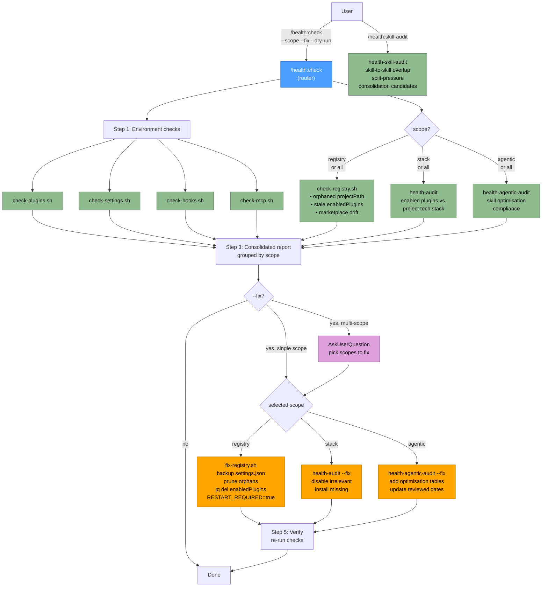

# Health Plugin Flow

## Legend

| Node style | Meaning |
|------------|---------|
| Blue | Router skill (`/health:check`) |
| Green | Read-only diagnostic script |
| Orange | Fix script (writes files, backs up first) |
| Purple | Interactive `AskUserQuestion` prompt |

## Scope → Skill mapping

| `--scope` | Check | Fix |
|-----------|-------|-----|
| `registry` | `health-plugins/scripts/check-registry.sh` | `health-plugins/scripts/fix-registry.sh` |
| `stack` | `health-audit/` workflow | `health-audit/` `--fix` flow |
| `agentic` | `health-agentic-audit/` workflow | `health-agentic-audit/` `--fix` flow |
| `all` | All of the above + environment checks | `AskUserQuestion` to pick scopes |

## Sibling skills (not scoped under `/health:check`)

| Skill | Invocation | Purpose |
|-------|------------|---------|
| `health-skill-audit` | `/health:skill-audit [--plugin X] [--strict]` | Skill-to-skill overlap, split-pressure, and consolidation candidates (read-only; report-only; writes `tmp/skill-audit/`). |
