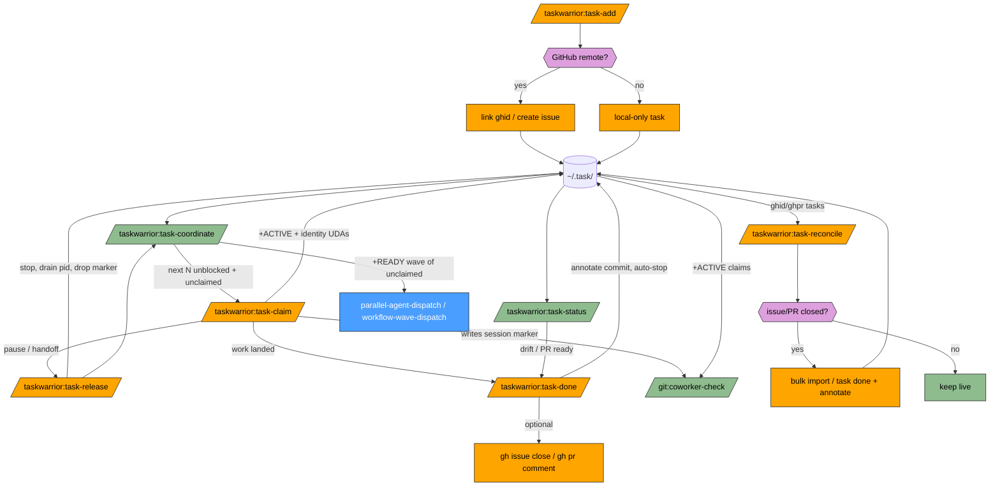

# taskwarrior-plugin Flow

How the skills fit together as a coordination layer for multi-agent work.

## Legend

| Class | Fill | Meaning |
|-------|------|---------|
| router | Blue | Orchestrating skill (external — the parallel / wave dispatch that consumes coordinate output) |
| check | Green | Read-only diagnostic / query |
| fix | Orange | Mutates the task store or GitHub |
| prompt | Purple | Decision point |

## Scope map

| Skill | Scope |
|-------|-------|
| `task-add` | Create / link tasks |
| `task-claim` | Claim a pending task (sets `+ACTIVE` + identity UDAs + session marker) |
| `task-release` | Release an active claim without closing (handoff) |
| `task-done` | Close / annotate tasks (auto-stops `+ACTIVE`) |
| `task-status` | Read queue state, including in-flight + stale claims and `+OVERDUE` |
| `task-coordinate` | Query `+READY` + unclaimed candidates for a dispatch wave |
| `task-reconcile` | Close tasks whose linked GitHub issue/PR closed or merged (dry-run by default) |
| `install-native-hooks` | Opt-in installer for taskwarrior native on-add/on-modify hooks (not in the diagram — a one-off setup action, not part of the task lifecycle) |

## Claim lifecycle

The `task-claim` / `task-release` / `task-done` triple is the identity
layer that lets `task-coordinate` and `/git:coworker-check` reason about
in-flight work:

| Transition | Effect on store | Effect on `/git:coworker-check` |
|-----------|------------------|-------------------------------|
| `task-claim` | Task gains `+ACTIVE` + `agent` / `pid` / `host` / `branch` / `worktree` UDAs | Writes `.git/.claude-session-<pid>` and baseline snapshot |
| `task-release` | `+ACTIVE` cleared, `pid` drained, annotation appended; `agent` / `host` / `branch` / `worktree` retained for handoff context (unless `--clear-identity`) | Drops the matching session marker (unless `--no-coworker-marker`) |
| `task-done` | `+ACTIVE` auto-stopped, task closed, commit hash annotated | Drops the matching session marker (unless `--no-coworker-marker`) |
