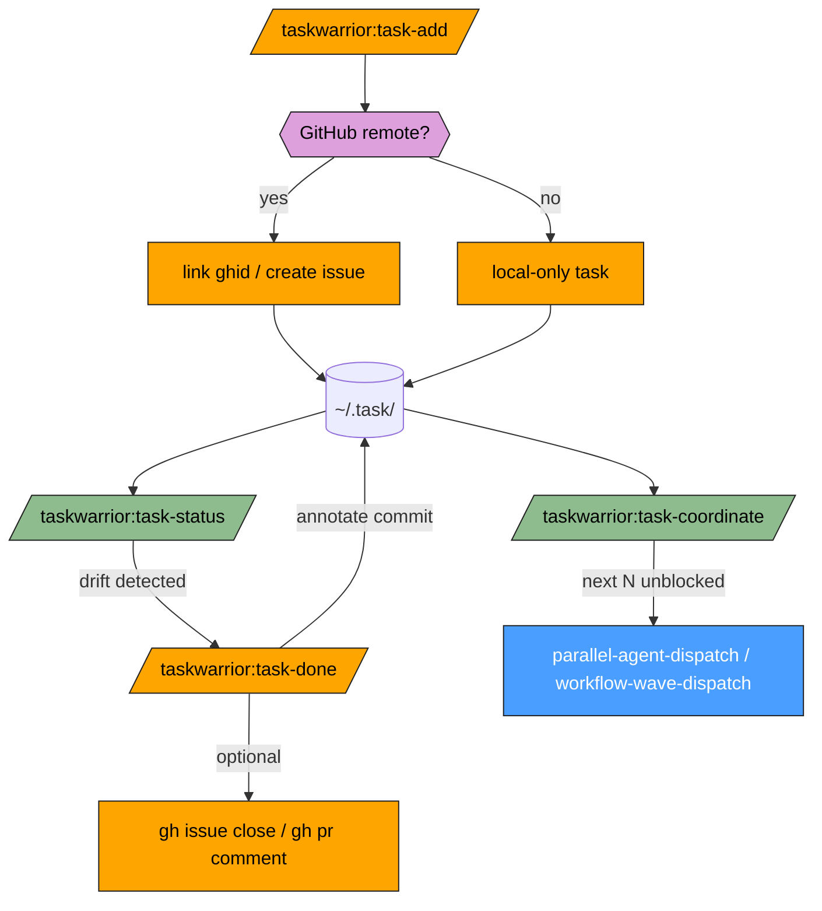

# taskwarrior-plugin Flow

How the skills fit together as a coordination layer for multi-agent work.

## Legend

| Class | Fill | Meaning |
|-------|------|---------|
| router | Blue | Orchestrating skill (external — the parallel / wave dispatch that consumes coordinate output) |
| check | Green | Read-only diagnostic / query |
| fix | Orange | Mutates the task store or GitHub |
| prompt | Purple | Decision point |

## Scope map

| Skill | Scope |
|-------|-------|
| `task-add` | Create / link tasks |
| `task-done` | Close / annotate tasks |
| `task-status` | Read queue state |
| `task-coordinate` | Query candidate agents for a dispatch wave |
