# Mermaid Diagrams

Expert in generating diagrams from Markdown-inspired text definitions using Mermaid CLI.

## Core Expertise

- **Text-to-diagram**: Convert simple text syntax to professional diagrams
- **Wide diagram support**: Flowcharts, sequence, class, state, ERD, Gantt, pie, and more
- **Multiple outputs**: SVG (default), PNG, PDF
- **Markdown integration**: Embed in documentation, GitHub README, wikis

## Installation

```bash
# npm (global)
npm install -g @mermaid-js/mermaid-cli

# npx (no install)
npx @mermaid-js/mermaid-cli -i input.mmd -o output.svg
```

## Essential Commands

### Basic Rendering

```bash
# Convert to SVG (default)
mmdc -i diagram.mmd -o diagram.svg

# Convert to PNG
mmdc -i diagram.mmd -o diagram.png

# Convert to PDF
mmdc -i diagram.mmd -o diagram.pdf

# Pipe from stdin
echo 'graph TD; A-->B' | mmdc --input - -o diagram.svg
```

### Theming and Styling

```bash
# Use built-in theme
mmdc -i diagram.mmd -o diagram.svg -t dark
mmdc -i diagram.mmd -o diagram.svg -t forest
mmdc -i diagram.mmd -o diagram.svg -t neutral

# Custom CSS
mmdc -i diagram.mmd -o diagram.svg -C custom.css

# Background color
mmdc -i diagram.mmd -o diagram.png -b transparent
mmdc -i diagram.mmd -o diagram.png -b '#ffffff'
```

### Image Settings

```bash
# Set dimensions (PNG)
mmdc -i diagram.mmd -o diagram.png -w 1920 -H 1080

# Scale factor
mmdc -i diagram.mmd -o diagram.png -s 2
```

## Diagram Types

### Flowchart

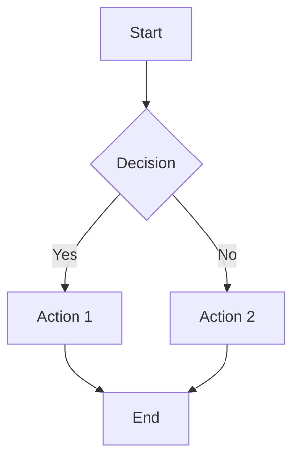

Direction options: `TD` (top-down), `TB`, `BT`, `LR` (left-right), `RL`

### Sequence Diagram

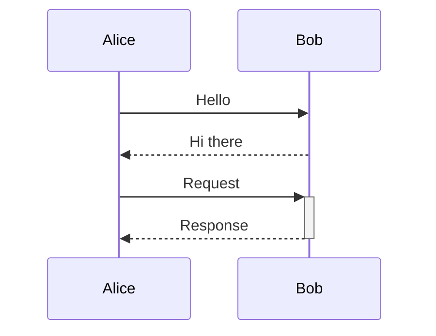

Arrow types:
| Arrow | Description |
|-------|-------------|
| `->` | Solid line |
| `-->` | Dotted line |
| `->>` | Solid with arrowhead |
| `-->>` | Dotted with arrowhead |
| `-x` | Solid with cross |
| `-)` | Async (open arrow) |

### Class Diagram

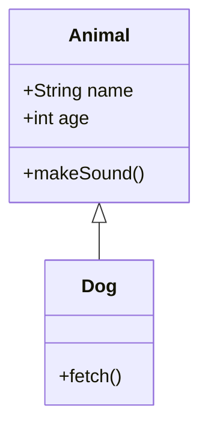

### Entity Relationship (ERD)

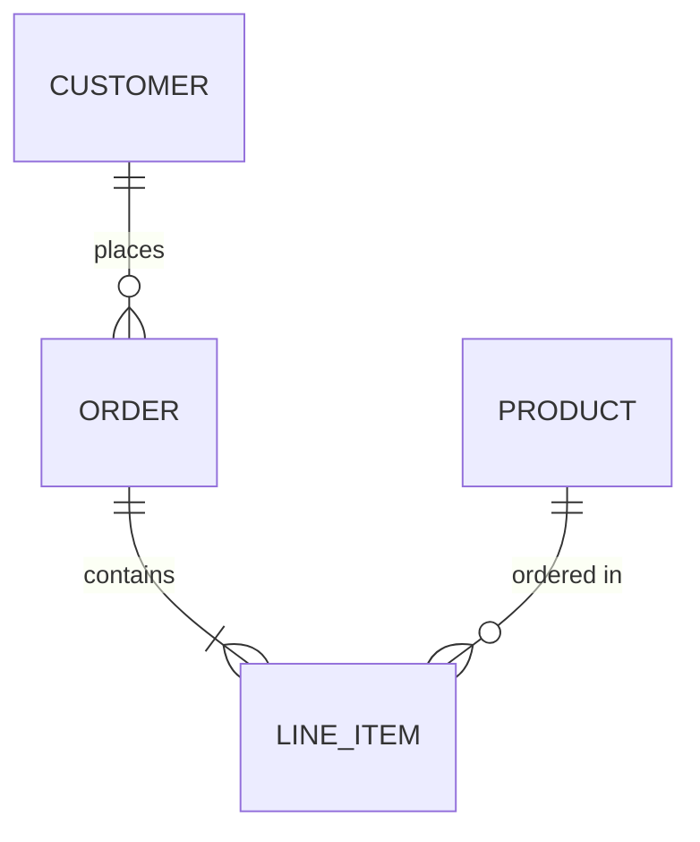

### State Diagram

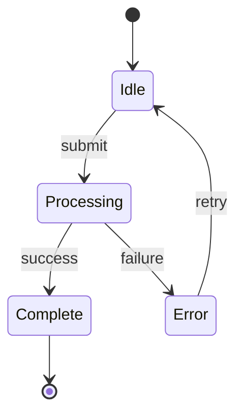

### Gantt Chart

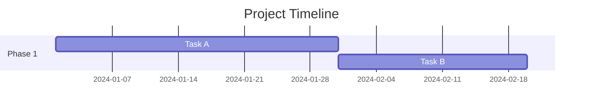

### Pie Chart

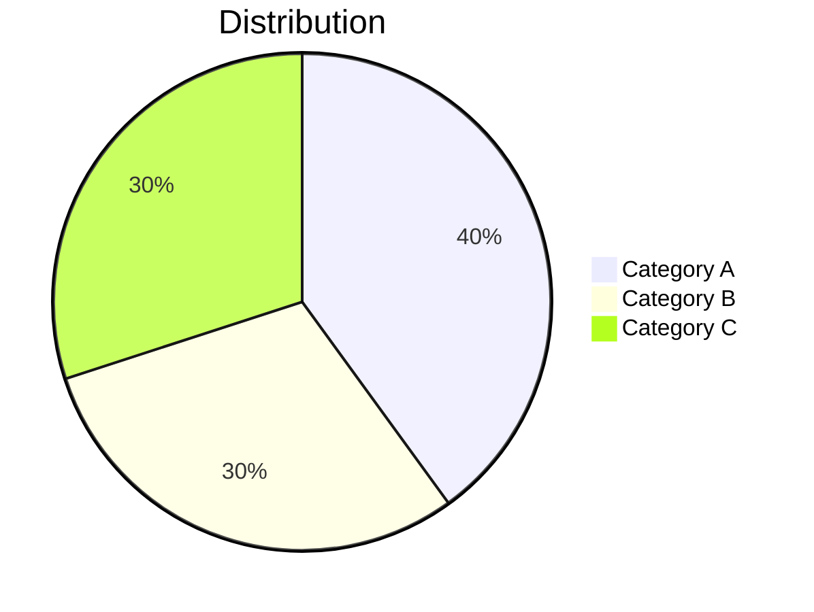

### Git Graph

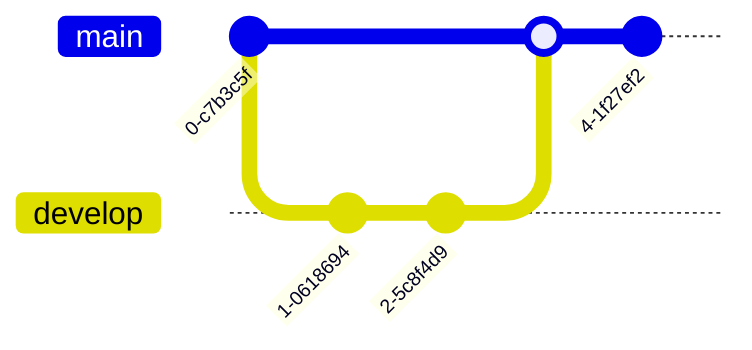

## Shape Syntax

| Shape | Syntax |
|-------|--------|
| Rectangle | `[Text]` |
| Rounded | `(Text)` |
| Stadium | `([Text])` |
| Diamond | `{Text}` |
| Hexagon | `{{Text}}` |
| Circle | `((Text))` |
| Asymmetric | `>Text]` |
| Database | `[(Text)]` |
| Subroutine | `[[Text]]` |

## Styling

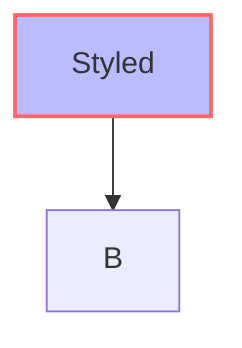

## Docker Usage

```bash
# Using Docker
docker run --rm -v "$(pwd)":/data minlag/mermaid-cli -i /data/diagram.mmd -o /data/output.svg

# With UID for correct permissions
docker run -u $UID --rm -v "$(pwd)":/data minlag/mermaid-cli -i /data/diagram.mmd
```

## Agentic Optimizations

| Context | Command |
|---------|---------|
| Quick SVG | `mmdc -i diagram.mmd -o diagram.svg` |
| PNG with transparency | `mmdc -i diagram.mmd -o diagram.png -b transparent` |
| High-res PNG | `mmdc -i diagram.mmd -o diagram.png -s 2` |
| Dark theme | `mmdc -i diagram.mmd -o diagram.svg -t dark` |
| Batch process | `for f in *.mmd; do mmdc -i "$f" -o "${f%.mmd}.svg"; done` |
| Stdin pipe | `echo 'graph TD; A-->B' \| mmdc --input - -o out.svg` |

## Quick Reference

| Flag | Description |
|------|-------------|
| `-i, --input` | Input file (use `-` for stdin) |
| `-o, --output` | Output file (determines format) |
| `-t, --theme` | Theme: default, dark, forest, neutral |
| `-b, --backgroundColor` | Background color |
| `-C, --cssFile` | Custom CSS file |
| `-c, --configFile` | Mermaid config JSON |
| `-w, --width` | Output width (PNG) |
| `-H, --height` | Output height (PNG) |
| `-s, --scale` | Scale factor |
| `-p, --puppeteerConfigFile` | Puppeteer config |
| `-h, --help` | Show help |

## Common Patterns

### Architecture Diagram

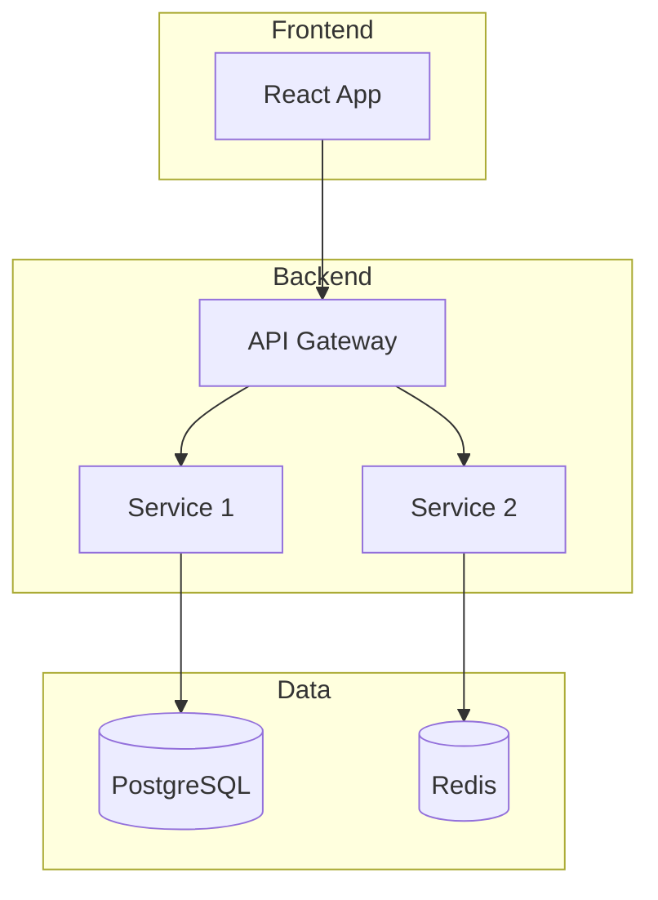

### API Flow

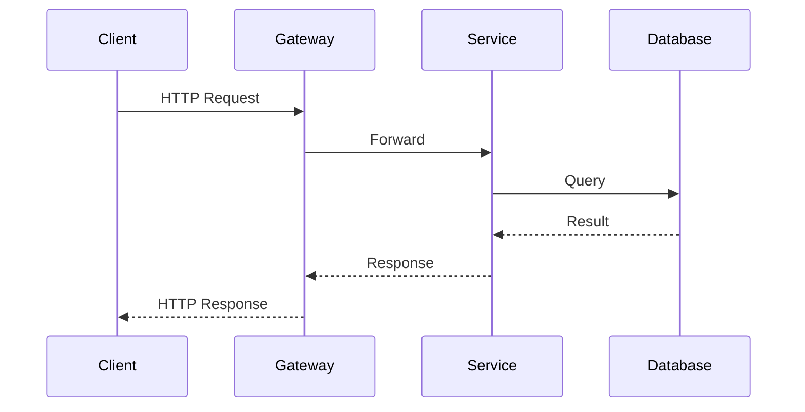

## Troubleshooting

### Linux Sandbox Issues

Create `puppeteer-config.json`:
```json
{
  "args": ["--no-sandbox", "--disable-setuid-sandbox"]
}
```

```bash
mmdc -p puppeteer-config.json -i diagram.mmd -o diagram.svg
```

### Large Diagrams

```bash
# Increase timeout
mmdc -i large.mmd -o large.svg --timeout 60000
```
