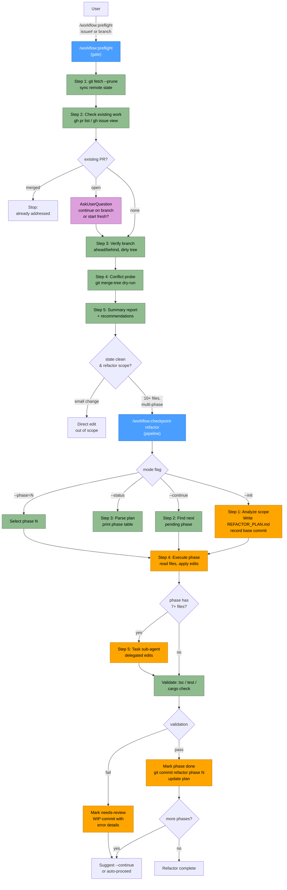

# Workflow Orchestration Plugin Flow

Pipeline: **preflight → checkpoint → refactor**. Validate remote state before committing to work, then execute large refactors through persistent, resumable phases.

## Legend

| Node style | Meaning |
|------------|---------|
| Blue | Router / pipeline-stage skill (`/workflow:preflight`, `/workflow:checkpoint-refactor`) |
| Green | Read-only diagnostic / validation step |
| Orange | Mutating step (writes plan file, commits, edits code) |
| Purple | Interactive `AskUserQuestion` prompt |

## Stage to Skill mapping

| Stage | Skill | Produces | Gates |
|-------|-------|----------|-------|
| Preflight | `workflow-preflight/` | Summary report: remote freshness, existing PRs, branch divergence, conflicts | Whether to proceed at all (blocks on merged PRs, dirty tree, detected conflicts) |
| Checkpoint (init) | `workflow-checkpoint-refactor/` `--init` | `REFACTOR_PLAN.md` with phased file groups, acceptance criteria, base commit | Entry point for refactors spanning 10+ files |
| Refactor (execute) | `workflow-checkpoint-refactor/` `--continue` / `--phase=N` | Per-phase commits (`refactor phase N: ...`), plan status updates, optional `needs-review` markers | Survives context limits — each phase reads/writes the plan file so sessions resume cleanly |

## Pipeline rationale

- **Preflight is a gate, not a step** — it produces no code change, only a go/no-go signal. Skipping it is the common cause of wasted refactor effort (duplicate PRs, rebase surprises mid-phase).
- **Checkpoint is the orchestrator** — `--init` defines the contract (`REFACTOR_PLAN.md`), subsequent invocations consume and mutate it.
- **Refactor phases are the atoms** — each phase is an independently committable, validatable unit. Failure marks `needs-review` rather than blocking the pipeline.
